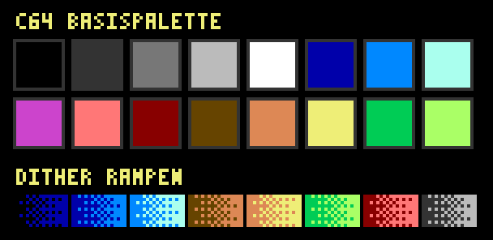
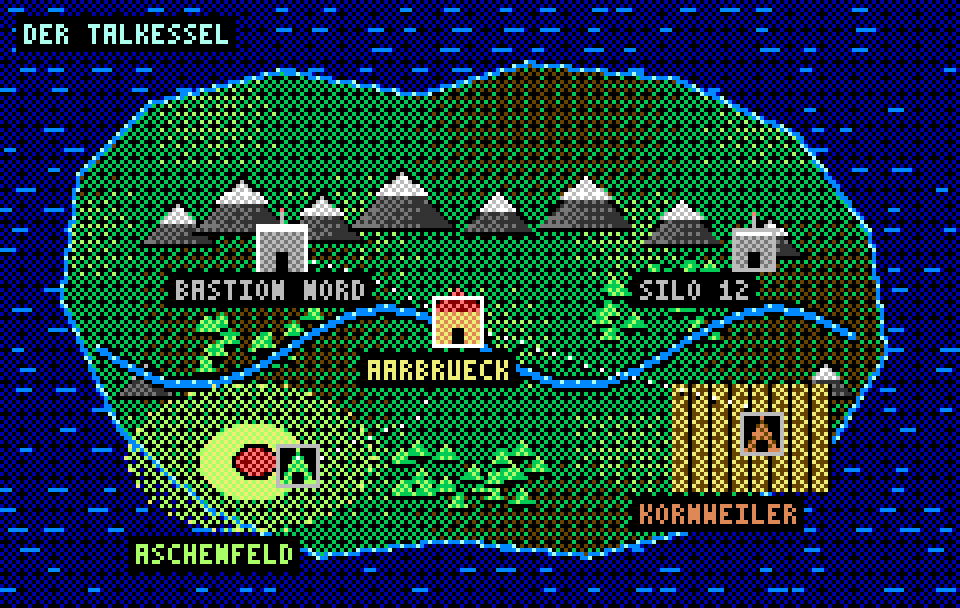
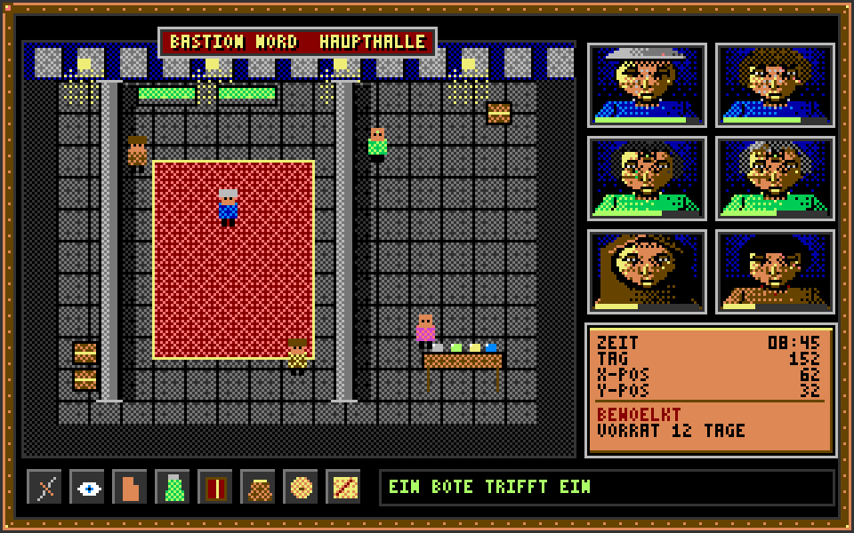
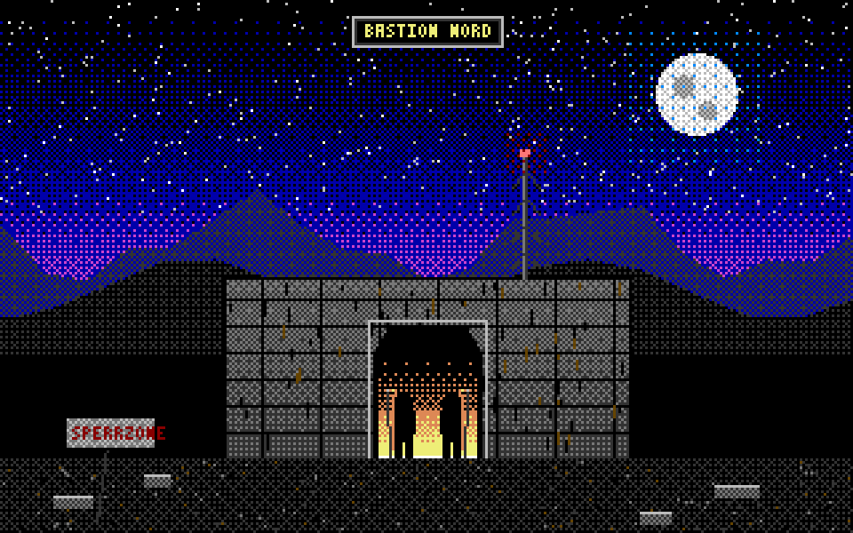
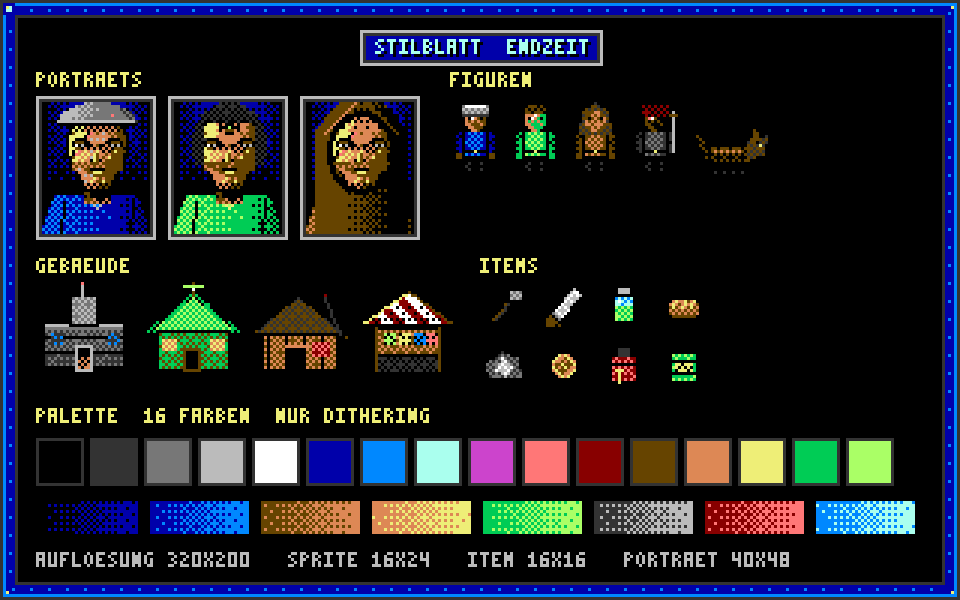

# TICKET-009: Grundlegendes visuelles Design (Art-Style) – Hauptticket

**Typ:** Design / Art Direction (Hauptticket)
**Epic:** Endzeit-Wirtschaftssimulator – Visuelle Identität
**Priorität:** Hoch
**Status:** Entwurf fertig, bereit für Review
**Abhängigkeiten:** TICKET-001 (Setting/Tonalität), TICKET-002 (Karte),
TICKET-008 (UI/UX-Grundkonzept)
**Leitet ab in:** TICKET-010 bis TICKET-017 (siehe Abschnitt 8)

> **Stilrevision (2026-09-20):** Verbindliche Stilreferenz ist ab sofort der
> C64-Look von *SKALD – Against the Black Priory*: 16-Farben-VIC-II-Palette,
> durchgängiges Bayer-Dithering, tiefschwarze Hintergründe. Die Struktur-,
> Raster- und Systemfestlegungen dieses Tickets gelten unverändert weiter;
> geändert haben sich Palette und Schattierungstechnik (Begründung und
> Regeln: TICKET-009, Abschnitt 20). Aktueller Asset-Satz:
> `design/assets/artstyle-c64/`, Generator: `tools/gen_assets_c64.py`.

## Ziel des Tickets

Festlegung des grundlegenden visuellen Stils für den gesamten Simulator:
Old-School-Amiga-Pixelgrafik mit deutlichem Retro-Touch, im Stil von
**Burntime** (Bunkerbau Software/Max Design, 1993). Dieses Hauptticket
definiert die übergreifenden gestalterischen Leitplanken (Auflösung,
Palette, Pixeldichte, Rendering-Regeln, Animationsphilosophie) und leitet
daraus acht Sub-Tickets ab, die jeweils einen konkreten visuellen Bereich
(Menüs, Hauptkarte, Porträts, Spielfiguren, Gebäude, Gegner, Items/Waren)
im Detail ausarbeiten. Alle Sub-Tickets referenzieren die hier festgelegten
Grundregeln, damit über das gesamte Spiel hinweg ein konsistenter,
"aus einem Guss" wirkender Retro-Look entsteht.

Zur Veranschaulichung wurden bereits erste programmatisch erzeugte
Pixel-Mockups angelegt (siehe `design/assets/artstyle-c64/`). Sie sind
bewusst als **Stilreferenzen** zu verstehen (Auflösung, Palette,
Kompositionslogik), nicht als finale, von Hand gepixelte Production-Art –
diese entsteht erst in der eigentlichen Asset-Produktion nach Freigabe
dieses Konzepts.

## 0. Einordnung gegenüber TICKET-008

Dieses Ticket vertieft und konkretisiert die in TICKET-008 bereits grob
angelegte visuelle Grundhaltung ("analog-diegetisch", fraktionsspezifische
visuelle Sprache, siehe TICKET-008 Abschnitt 1 und 4). Während TICKET-008
die Bildschirmstruktur und Interaktionslogik der Oberfläche definiert, legt
dieses Hauptticket die darunterliegende, projektweite Bildsprache fest:
Auflösung, Farbpalette, Pixeldichte und Animationsprinzip, auf denen alle in
TICKET-008 beschriebenen Bildschirme visuell aufbauen. Beide Tickets
ergänzen sich damit, statt sich zu überschneiden: TICKET-008 beantwortet
"welche Bildschirme gibt es und wie navigiert man sie", dieses Hauptticket
beantwortet "wie sieht alles darauf konkret aus".

## 1. Warum Burntime als Referenz?

Burntime ist ein 1993 erschienenes, deutsches Endzeit-Rollenspiel, das
thematisch und stilistisch außergewöhnlich gut zum hier entwickelten
Setting (siehe TICKET-001) passt: eine radioaktiv verseuchte Erde nach
einem globalen Krieg, Überlebende in befestigten Städten und Mutierte in
den Ödlanden, eine erdige, ungeschönte Farbpalette statt glänzender
Zukunftsvisionen, sowie ein charakteristisches Dialogsystem mit
Porträt-Büsten und Antwortoptionen. Die Wahl dieses Referenzstils ist
sowohl inhaltlich als auch produktionstechnisch sinnvoll: Ein bewusst
niedrig aufgelöster, palettenreduzierter Pixelart-Stil erlaubt es, mit
überschaubarem Produktionsaufwand eine hohe Anzahl an Sprites (drei
Fraktionen, mehrere Gebäudetypen, diverse Gegner und Items, siehe
TICKET-001 bis TICKET-007) konsistent umzusetzen, ohne in die Kostenfalle
hochauflösender, aufwändig animierter moderner Grafik zu geraten. Zugleich
verstärkt der Retro-Look die im gesamten Design-Dokument angelegte
Grundhaltung "geerdet statt spektakulär" (siehe TICKET-001, Leitplanken).

## 1.1 Kurzeinordnung des Referenzspiels

Burntime wurde 1993 vom deutschen Studio Bunkerbau Software entwickelt und
von Max Design/Sales Curve veröffentlicht, ursprünglich für DOS mit
späteren Portierungen unter anderem auf Amiga-kompatible Systeme. Für
dieses Projekt relevant ist nicht die genaue Plattformhistorie, sondern die
charakteristische Bildsprache jener Ära: niedrige, feste Auflösungen,
kleine, indizierte Farbpaletten und daraus resultierend ein sehr
eigenständiger, heute nostalgisch wirkender "Retro-Touch", den dieses
Projekt bewusst und explizit als Stilrichtung aufgreifen soll, wie in der
Aufgabenstellung dieses Haupttickets gefordert.

## 2. Zielauflösung und Pixelraster

Als logische Innenauflösung wird, angelehnt an klassische Amiga-/DOS-Spiele
der frühen 1990er, ein Raster von **320×200 bis 320×240 Pixeln** als
Referenzgröße für Vollbildszenen (Hauptkarte, Dialogszenen) festgelegt.
Einzelne UI-Elemente und Sprites werden auf Basis kleinerer, klar
definierter Rastergrößen entworfen (siehe Sub-Tickets für konkrete
Maße je Kategorie, z. B. 16×24 Pixel für Charaktersprites, 32×32 Pixel für
Porträts). Die Darstellung auf modernen Bildschirmen erfolgt ausschließlich
über **ganzzahlige Skalierung** (2x, 3x, 4x, 6x) mit Nearest-Neighbor-
Interpolation – niemals mit weichem Schärfen oder Bilinear-Filterung –, um
die charakteristische harte Pixelkante zu erhalten, die für den gewünschten
Retro-Touch essenziell ist.

## 3. Farbpalette

Es wird eine gemeinsame, reduzierte Basispalette definiert – ursprünglich
rund 32 erdige Farben, seit der Stilrevision verbindlich die
**16-Farben-C64-Palette** (siehe Abschnitt 20) (siehe `design/assets/artstyle-c64/01_palette.png`), angelehnt an die
Farbtiefe klassischer Amiga-OCS-Grafik (ursprünglich 32 von 4096 Farben).
Die Palette ist bewusst erdig und entsättigt gehalten: Braun-, Grau- und
Grüntöne dominieren, ergänzt um wenige kräftige Akzentfarben (Warnrot,
Warngelb, Giftgrün für Kontamination) für Lesbarkeit kritischer
Spielinformationen. Jede Fraktion erhält innerhalb dieser Basispalette eine
eigene, klar abgegrenzte Akzentfarbgruppe (Bunker: Stahlblau/Grau, Mutierte:
Oliv-/Giftgrün mit Ockerakzenten, Wastelander: Sandbraun/Rostrot), die in
den jeweiligen Sub-Tickets (010, 014, 015) konkretisiert wird. Farbverläufe
und weiche Schattierungen werden grundsätzlich vermieden; stattdessen kommt,
wie im Amiga-Zeitalter üblich, **Dithering** (Schachbrettmuster aus zwei
Palettenfarben) für Schattierung und Texturwirkung zum Einsatz, sichtbar
etwa im Kartenmockup `02_hauptkarte.png`.

## 4. Pixeldichte, Silhouette und Lesbarkeit

Da die Zielauflösung sehr niedrig ist, muss jedes Sprite in erster Linie
über eine klare, eindeutig lesbare **Silhouette** funktionieren, nicht über
Detailzeichnung. Charaktersprites (siehe TICKET-014, 016) folgen einer
einfachen Blockgliederung (Kopf, Torso, Arme, Beine als klar getrennte
Rechtecke/Formen), Gebäude (TICKET-015) einer klaren Grundform
(Rechteck plus Dachform), die schon aus der Ferne (kleine Kartenansicht,
siehe TICKET-012) fraktionszugehörig erkennbar bleibt. Ein Prinzip aus dem
Referenzspiel wird explizit übernommen: **Wiedererkennung durch Silhouette
und Akzentfarbe, nicht durch Detailtreue**. Das in Abschnitt 3 beschriebene
Fraktionsfarbschema ist dabei das primäre Unterscheidungsmerkmal.

## 5. Animationsphilosophie

Anders als moderne, oft mit 12-24 Bildern pro Sekunde flüssig animierte
Spiele setzt der Stil bewusst auf **limitierte Animation** im Stil
klassischer Amiga-Titel: 2 bis 4 Frames für Bewegungszyklen (z. B.
Gehanimation), einzelne, klar erkennbare Idle-Posen statt subtiler
Idle-Bewegung, sowie punktuelle, aber wirkungsvolle Ein-Frame-Effekte für
Aktionen (Angriff, Ernte, Handwerk). Diese bewusste Reduktion ist keine
technische Notlösung, sondern eine gestalterische Entscheidung im Sinne der
Retro-Authentizität und hält den Produktionsaufwand für die in TICKET-001
definierten drei Fraktionen plus Randgruppen (siehe TICKET-005, Abschnitt 8)
überschaubar.

## 6. Kontrast zwischen Weltkarte und Detailszenen

Wie im Referenzspiel wird zwischen zwei visuellen Modi unterschieden: einer
eher schematischen, kartenartigen **Übersichtsdarstellung** (Hauptkarte,
siehe TICKET-012 und TICKET-002) mit kleinen, symbolhaften Icons für
Siedlungen und Ressourcen, sowie **Detailszenen** (Dialoge, Handel,
Kampfszenen) mit größer dargestellten Porträts und Sprites (siehe
TICKET-011, 013). Diese Zweiteilung erlaubt es, auf der Hauptkarte
Übersichtlichkeit über eine große, in TICKET-002 beschriebene Region zu
wahren, während in Detailszenen genug visueller Raum für Charakterausdruck
und atmosphärische Dichte bleibt.

## 7. Ton, Licht und Atmosphäre ohne moderne Effekte

Bewusst verzichtet wird auf dynamische Beleuchtung, Partikeleffekte,
Bloom/Glow oder Schattenwurf-Simulation, wie sie in modernen Engines
Standard sind. Stimmung entsteht stattdessen – konsistent mit dem
Referenzstil – über die Farbpalette selbst (kühlere, gedämpfte Töne für
Bunkerinnenräume, warme, erdige Töne für Wastelander-Siedlungen, giftig-
grelle Akzente für Kontaminationszonen, siehe TICKET-002), über Dithering-
Texturen und über die im Kartenmockup sichtbare, bewusst "gemalt" wirkende
Oberflächenstruktur des Terrains. Dieser Verzicht auf moderne
Beleuchtungstechnik ist zentral für die angestrebte Amiga-Authentizität und
soll in keinem Sub-Ticket unterlaufen werden.

## 8. Übersicht der Sub-Tickets

| Ticket | Thema | Kernumfang |
|---|---|---|
| [TICKET-010](TICKET-010-art-genereller-stil.md) | Genereller Stil | Palette-Detailregeln, Rastergrößen, Outline-/Dithering-Konventionen, Referenzvergleich zu Burntime |
| [TICKET-011](TICKET-011-art-menues.md) | Menüs | Hauptmenü, Dialogsystem (Porträt + Text + Antwortoptionen), Inventar-/Handelsfenster |
| [TICKET-012](TICKET-012-art-hauptkarte.md) | Hauptkarte | Terrain-Tiles, Kontaminations-Overlays, Siedlungsicons, Routenmarkierungen |
| [TICKET-013](TICKET-013-art-portraets.md) | Porträts | Dialogbüsten je Fraktion, Ausdrucksvarianten, Alters-/Statusvarianten |
| [TICKET-014](TICKET-014-art-spielfiguren-fraktionen.md) | Spielfiguren – Fraktionen | Charaktersprites Bunker/Mutierte/Wastelander, Posen, Animationssätze |
| [TICKET-015](TICKET-015-art-gebaeude-fraktionen-neutral.md) | Gebäude – Fraktionen & neutral | Gebäudesprites je Fraktion sowie neutrale Bauten (Aarbrück) |
| [TICKET-016](TICKET-016-art-gegner.md) | Gegner | Banden/Räuber, wilde Kreaturen, Randgruppen-Einheiten |
| [TICKET-017](TICKET-017-art-items-waren.md) | Items / Waren | Icon-Grid für Ressourcen, Werkzeuge, Waffen, Medizin, Handelsgüter |

## 9. Verbindliche Grundregeln für alle Sub-Tickets

Damit die acht Sub-Tickets nicht unabhängig voneinander divergieren, gelten
folgende Regeln als verbindlich für jede weitere Ausarbeitung:

1. Jedes neue Asset verwendet ausschließlich Farben aus der in Abschnitt 3
   definierten Basispalette (Erweiterungen der Palette müssen explizit in
   diesem Hauptticket nachgetragen werden, nicht in einem Sub-Ticket im
   Alleingang).
2. Jedes Sprite/Icon hält sich an die in den jeweiligen Sub-Tickets
   festgelegten Rastergrößen und wird ausschließlich ganzzahlig skaliert.
3. Fraktionszugehörigkeit wird primär über Akzentfarbe und Silhouette
   kommuniziert, nicht über zusätzliche Detailzeichnung.
4. Schattierung erfolgt über Dithering, nicht über Farbverläufe oder
   moderne Beleuchtungseffekte.
5. Animation bleibt auf 2-4 Frames pro Zyklus begrenzt, sofern im
   jeweiligen Sub-Ticket nicht anders begründet.

## 9.1 Konsistenzprüfung als wiederkehrender Schritt

Da acht verschiedene Sub-Tickets unabhängig ausgearbeitet werden, ist vor
Abschluss der jeweiligen Umsetzung eine kurze Konsistenzprüfung gegen die
fünf Grundregeln aus Abschnitt 9 vorgesehen: Stimmen die verwendeten Farben
mit der Basispalette überein, sind Rastergrößen eingehalten, ist die
Fraktionszugehörigkeit auch ohne Beschriftung erkennbar, wurde
ausschließlich mit Dithering statt Verläufen gearbeitet, und liegt die
Animation im vorgesehenen Frame-Budget? Diese Prüfung soll denselben
Charakter haben wie die Akzeptanzkriterien am Ende jedes Tickets und kann
bei zukünftigen Erweiterungen (siehe TICKET-002, Abschnitt 13:
Nachbarregionen) unverändert wiederverwendet werden.

## 10. Zusammenspiel mit den inhaltlichen Systemtickets

Der Art-Style ist kein Selbstzweck, sondern muss die in TICKET-001 bis
TICKET-007 beschriebenen Systeme visuell transportieren: Kontaminationsstufen
(TICKET-002) müssen auf der Karte (TICKET-012) eindeutig unterscheidbar
sein, Bedürfnisstatus (TICKET-007) und Eskalationsstufen (TICKET-005)
müssen in den Menüs (TICKET-011) klar lesbar dargestellt werden, und die in
TICKET-006 beschriebenen Technologiestufen sollen sich in der visuellen
Qualität von Gebäuden und Ausrüstung (TICKET-015, TICKET-017) niederschlagen
können. Jedes Sub-Ticket verweist explizit auf die jeweils relevanten
inhaltlichen Tickets, um diesen Zusammenhang nicht zu verlieren.

## 11. Abgrenzung: Inspiration statt Kopie

Wichtig für die weitere Produktion ist eine klare rechtliche und
gestalterische Abgrenzung: Burntime dient ausschließlich als **stilistische
Referenz** für Auflösung, Farbbehandlung, Silhouettenlogik und
UI-Aufbauprinzipien (siehe Abschnitt 2-6), nicht als Vorlage zum Kopieren
konkreter Assets, Schriftzüge oder Icons. Alle in den Sub-Tickets
beschriebenen und später produzierten Grafiken (einschließlich der bereits
erzeugten Mockups in `design/assets/artstyle-c64/`) sind eigenständige, an das
in TICKET-001 bis TICKET-007 entwickelte Setting angepasste Neuschöpfungen.
Diese Abgrenzung ist besonders relevant für Kartendarstellung
(TICKET-012) und Dialogsystem (TICKET-011), die dem Referenzspiel
konzeptionell am nächsten stehen.

## 12. Vergleich: Burntime-Prinzipien und ihre Übertragung

Zur Konkretisierung, wie einzelne Referenzprinzipien in dieses Projekt
übersetzt werden:

| Burntime-Prinzip | Übertragung auf dieses Projekt |
|---|---|
| Wüstenhafte, ockerlastige Postapokalypse-Palette | Erdige, aber regional differenzierte Palette (Talkessel-Grün/Braun statt reiner Wüstenton, siehe TICKET-002) |
| Kreisförmige Dialogporträts mit Antwortoptionen | Übernommen als Grundprinzip (TICKET-011), aber mit fraktionsspezifischem Rahmenstil (TICKET-010) |
| Einfache, symbolhafte Weltkarte mit Stadtpunkten | Übertragen auf die Talkessel-Region (TICKET-002/012) mit zusätzlichen Kontaminations- und Routen-Overlays |
| Wenige, aber prägnante Gegnertypen | Übertragen auf Randgruppen/Kreaturen (TICKET-016), ergänzt um die drei Hauptfraktionen als spielbare Seiten statt reiner Gegner |
| Textbasierte, atmosphärische Ereignisbeschreibungen | Direkt konsistent mit dem in TICKET-008 (Abschnitt 9) beschriebenen Benachrichtigungsstil |

Diese Tabelle soll allen an der Umsetzung Beteiligten als schnelle
Orientierung dienen, welche Referenzidee wo im eigenen Projekt wiederzufinden
ist, ohne dass eine direkte grafische Übernahme stattfindet.

## 13. Produktionspipeline-Hinweis

Für die spätere tatsächliche Asset-Produktion (außerhalb dieser
Design-Runde, siehe Offene Punkte) wird empfohlen, zunächst je Sub-Ticket
ein kleines, verbindliches **Referenzblatt** ("Style Sheet") mit den
konkreten Rastergrößen, der jeweils zulässigen Farbteilmenge und ein bis
zwei Beispielsprites zu erstellen, bevor die volle Asset-Menge (alle
Gebäudetypen, alle Itemtypen, alle Animationszyklen) produziert wird. Dies
verhindert nachträgliche Stilbrüche, wie sie entstehen, wenn viele Assets
parallel ohne gemeinsames Referenzblatt erarbeitet werden. Die in diesem
Hauptticket hinterlegten Mockups (`design/assets/artstyle-c64/`) erfüllen für
die aktuelle Design-Phase bereits diese Referenzfunktion in vereinfachter
Form.

## 14. Governance: Änderungen an der Basispalette

Da alle Sub-Tickets auf derselben, in Abschnitt 3 definierten Basispalette
aufbauen, gilt jede spätere Änderung an dieser Palette als potenziell
projektweit wirksam. Soll eine neue Farbe ergänzt oder eine bestehende
Farbe verändert werden, muss dies über eine Aktualisierung dieses
Haupttickets erfolgen, nicht isoliert in einem einzelnen Sub-Ticket. Diese
Regel verhindert, dass unterschiedliche Sub-Tickets im Laufe der Zeit
inkompatible, leicht unterschiedliche Grüntöne oder Grauabstufungen
verwenden, was die angestrebte visuelle Konsistenz des Gesamtprojekts
untergraben würde.

## Offene Punkte für Folgetickets

- Finale, von Hand gepixelte Production-Art auf Basis der hier
  freigegebenen Stilregeln (separates Produktionsticket, außerhalb dieser
  Design-Runde).
- Soundästhetik im Retro-Stil (chiptune-artige Musik, 8-/16-Bit-
  Soundeffekte) als Ergänzung zum visuellen Stil – eigenes Ticket
  erforderlich.
- Technische Umsetzungsdetails (Sprite-Sheets, Asset-Pipeline, Engine-
  Anforderungen für Nearest-Neighbor-Rendering).

## 15. Warum kein "modernisierter" Retro-Look?

Es wäre technisch einfach, einen "modernisierten" Retro-Look zu wählen –
niedrige Auflösung kombiniert mit modernen Weichzeichnungs-, Beleuchtungs-
und Partikeleffekten, wie es in vielen aktuellen "Pixel-Art"-Indie-Spielen
verbreitet ist. Für dieses Projekt wird bewusst dagegen entschieden: Die in
Abschnitt 7 beschriebene, konsequente Reduktion auf Palette und Dithering
ohne moderne Effekte ist Teil der inhaltlichen Aussage des Spiels – eine
Welt, die technologisch drei Jahrzehnte zurückgeworfen wurde (siehe
TICKET-001, Abschnitt 2), soll sich auch visuell konsequent "roh" und
unpoliert anfühlen, statt durch glatte moderne Effekttechnik einen
Widerspruch zur erzählten Realität zu erzeugen. Diese bewusste
Beschränkung ist eine der zentralen Designentscheidungen dieses Haupttickets
und soll in keinem der acht Sub-Tickets aus stilistischer Bequemlichkeit
aufgeweicht werden.

## 20. Stilrevision (2026-09-20): C64-Referenz statt flacher Amiga-Look

Nach Sichtung konkreter Referenzbilder wird die Stilrichtung dieses
Haupttickets präzisiert. Verbindliche Referenz ist ab sofort der
C64-Look von **SKALD – Against the Black Priory**. Die Grundhaltung aus
Abschnitt 1 bis 15 (niedrige Auflösung, Silhouette vor Detail, limitierte
Animation, keine modernen Effekte) bleibt unverändert gültig; präzisiert
werden Palette und Schattierungstechnik.

### 20.1 Was sich ändert

| Festlegung | Vorher (Abschnitt 3/7) | Jetzt verbindlich |
|---|---|---|
| Palette | ~32 erdige Farben, frei definiert | **16 Farben, VIC-II/C64 (Pepto)** – keine Zwischentöne, keine Palettenerweiterung |
| Schattierung | Dithering optional neben Volltonflächen | **Durchgängiges 8×8-Bayer-Dithering** als einziges Mittel für Zwischentöne |
| Hintergründe | gedeckte Flächen | **Tiefes Schwarz** als Bildgrund, Formen mit hartem Kontrast davor |
| Kontrast | entsättigt, flach | **hoch** – gesättigte Akzente (Gelb, Orange, Cyan, Lichtgrün) gegen Schwarz |
| Schrift | Bitmap-Font, 8×8/8×10 | **eigener 3×5-Bitmapfont**, ohne Umlaute (AE/OE/UE) |

### 20.2 Was unverändert bleibt

Rastergrößen (TICKET-010, Abschnitt 2), Silhouetten-Primat (Abschnitt 4),
Animationsbudget von 2-4 Frames (Abschnitt 5), die Trennung zwischen
Übersichts- und Detaildarstellung (Abschnitt 6), der Verzicht auf
dynamische Beleuchtung (Abschnitt 7) sowie die Governance-Regel zur
Palette (Abschnitt 14) – letztere gilt nun für die 16-Farben-Palette.

### 20.3 Reproduzierbarkeit statt Einzelbilder

Der gesamte Asset-Satz wird nicht mehr als Sammlung einzeln bearbeiteter
PNGs gepflegt, sondern durch einen deterministischen Generator erzeugt:
`tools/gen_assets_c64.py`. Er enthält Palette, Dither-Matrix, Pixelfont
und alle Zeichenroutinen; jede Stiländerung erfolgt dort und wirkt sofort
auf sämtliche Assets. Ausgabe:

- `design/assets/artstyle-c64/native/` – native Pixelgröße, vom Spiel und
  vom Prototyp (`prototype/main.py`) direkt verwendet
- `design/assets/artstyle-c64/` – ganzzahlig hochskalierte Vorschau für
  Tickets und Review

Der frühere, flachere Entwurfssatz wurde mit der Revision entfernt; die
Versionshistorie des Repositories bleibt die einzige Quelle dafür.

### 20.4 Abgrenzung

Wie schon in Abschnitt 11 festgehalten, dient auch die neue Referenz
ausschließlich als Stilvorbild für Palette, Dithering, Rahmenaufbau und
Bildaufteilung. Es werden keinerlei Assets, Schriftzüge oder Motive aus
dem Referenzspiel übernommen; alle Grafiken sind eigenständige
Neuschöpfungen für das in TICKET-001 bis TICKET-007 entwickelte Setting.

## Akzeptanzkriterien

- [x] Stilreferenz begründet verankert (revidiert in Abschnitt 20:
      C64-Look statt flacher Amiga-Look).
- [x] Zielauflösung und Skalierungsregeln definiert.
- [x] Gemeinsame Basispalette mit Beispielgrafik (`01_palette.png`)
      hinterlegt (16-Farben-C64-Palette, siehe Abschnitt 20).
- [x] Grundregeln zu Silhouette, Dithering und Animation festgelegt.
- [x] Acht Sub-Tickets abgeleitet und verlinkt.
- [x] Stilrevision auf C64-Referenz dokumentiert (Abschnitt 20), Assets
      über `tools/gen_assets_c64.py` reproduzierbar erzeugt.
- [x] Umfang mindestens 2000 Wörter.

## Beispielgrafiken (C64-Stilrevision)

Vorschau (hochskaliert); native Pixeldateien liegen unter
`design/assets/artstyle-c64/native/`.

