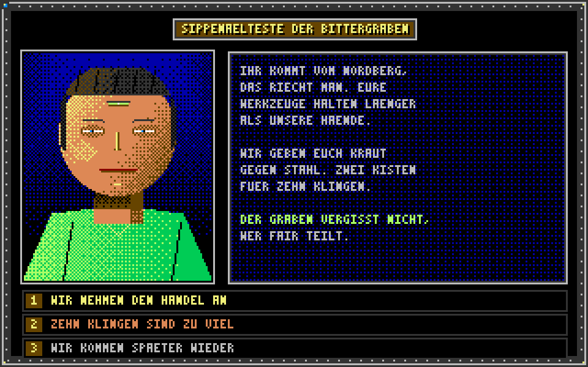

# TICKET-011: Menüs (Art-Style)

**Typ:** Design / Art Direction (Sub-Ticket)
**Epic:** Endzeit-Wirtschaftssimulator – Visuelle Identität
**Priorität:** Hoch
**Status:** Entwurf fertig, bereit für Review
**Abhängigkeiten:** TICKET-009 (Hauptticket), TICKET-010 (Generelle
Stilregeln), TICKET-008 (UI/UX-Bildschirmstruktur)
**Geschwistertickets:** TICKET-012 bis TICKET-017

> **Stilrevision (2026-09-20):** Verbindliche Stilreferenz ist ab sofort der
> C64-Look von *SKALD – Against the Black Priory*: 16-Farben-VIC-II-Palette,
> durchgängiges Bayer-Dithering, tiefschwarze Hintergründe. Die Struktur-,
> Raster- und Systemfestlegungen dieses Tickets gelten unverändert weiter;
> geändert haben sich Palette und Schattierungstechnik (Begründung und
> Regeln: TICKET-009, Abschnitt 20). Aktueller Asset-Satz:
> `design/assets/artstyle-c64/`, Generator: `tools/gen_assets_c64.py`.

## Ziel des Tickets

Visuelle Ausarbeitung aller Menü- und Dialogflächen im Burntime-inspirierten
Pixel-Art-Stil: Hauptmenü, das charakteristische Dialogsystem mit
Porträt-Büste, Textbox und Antwortoptionen, sowie Inventar- und
Handelsfenster. Dieses Ticket konkretisiert, wie die in TICKET-008
beschriebenen Bildschirme (Kartenansicht, Siedlungsübersicht,
Handelsbildschirm, Rat-/Diplomatiebildschirm, Forschungsbildschirm)
grafisch im festgelegten Stil (TICKET-009, TICKET-010) umgesetzt werden.

## 0. Verhältnis zu TICKET-008 und TICKET-010

Dieses Ticket setzt die in TICKET-008 rein funktional/strukturell
beschriebenen Bildschirme (Abschnitt 2 dort) visuell nach den in
TICKET-010 festgelegten technischen Regeln (Rastergrößen, Palette,
Dithering) um. Wo TICKET-008 etwa festlegt, dass der Handelsbildschirm
Vertragskarten zeigt, legt dieses Ticket fest, wie diese Vertragskarten
tatsächlich gepixelt aussehen. Widersprüche zwischen diesem Ticket und
TICKET-008 sind nicht vorgesehen; sollte sich im Zuge der Detailarbeit ein
Konflikt zeigen, hat die strukturelle Festlegung aus TICKET-008 Vorrang,
und dieses Ticket ist entsprechend anzupassen.

## 1. Referenzmockup: Dialogfenster

Das zentrale Referenzelement ist das Dialogfenster
(`design/assets/artstyle/08_menue_dialog.png`), das die Burntime-typische
Anordnung übernimmt: links eine kreisförmig maskierte Porträtbüste (siehe
TICKET-013) mit darunterliegendem Namensschild, rechts ein Textfeld für
den Dialoginhalt, darunter eine Liste von Antwortoptionen als einzeln
umrandete Balken. Dieses Grundlayout wird für alle Verhandlungsdialoge
(siehe TICKET-004, Abschnitt 11 und 13; TICKET-005, Abschnitt 6) verwendet.

## 1.1 Warum das Burntime-Dialogprinzip funktioniert

Das Prinzip aus Abschnitt 1 ist nicht nur eine stilistische Hommage,
sondern auch spielmechanisch sinnvoll: Die feste Dreiteilung in Porträt,
Text und Optionen erlaubt es, komplexe Verhandlungssysteme (siehe
TICKET-004, Abschnitt 9 und 11) über eine kleine Zahl klar wiederholbarer
Layoutbausteine abzubilden, statt für jede Verhandlungsart ein eigenes
UI-Layout zu entwerfen. Dieselbe Struktur trägt sowohl einfache
Marktgespräche als auch folgenreiche diplomatische Verhandlungen
(TICKET-005, Abschnitt 6), was die Wiedererkennbarkeit für Spieler über
unterschiedliche Spielsysteme hinweg deutlich erhöht.

## 2. Rahmen- und Panelgestaltung

Alle Menüfenster nutzen einen einheitlichen, aus der Neutralgruppe
(TICKET-010, Abschnitt 1) zusammengesetzten Rahmenaufbau: eine äußere,
dunkelbraune Umrandung mit innerer Pergament-farbener Linie (sichtbar im
Dialogmockup), die an abgenutztes, laminiertes Kartenmaterial erinnert. Im
Gegensatz zu glatten, modernen UI-Rahmen mit Farbverläufen oder
Transparenz-Ebenen bestehen alle Rahmenkanten aus klar gepixelten,
sich wiederholenden 8×8-Kachelsegmenten (siehe TICKET-010, Abschnitt 2:
UI-Rahmenkachel), die beliebig in der Länge wiederholt werden können, um
Fenster unterschiedlicher Größe (kleines Antwortfeld vs. großes
Handelsfenster) mit demselben Kachelsatz abzudecken.

## 2.1 Wiederverwendbarkeit der Rahmenkacheln

Der 8×8-Kachelsatz aus Abschnitt 2 wird so entworfen, dass er sich nicht
nur horizontal, sondern auch vertikal beliebig wiederholen lässt (Ecken,
Kanten, Füllsegmente als separate Kacheln), damit ein und derselbe
Kachelsatz sowohl das kleine Antwortoptionsfeld aus Abschnitt 5 als auch
das große Handelsfenster aus Abschnitt 6 abdecken kann, ohne dass für jede
Fenstergröße ein eigenes, festes Rahmenbild erstellt werden müsste. Dieses
klassische "9-Slice"-Prinzip ist mit dem Retro-Stil vollständig
kompatibel, solange die Kachelübergänge weiterhin harte Pixelkanten statt
weicher Interpolation nutzen.

## 3. Fraktionsspezifische Rahmenvarianten

Aufbauend auf TICKET-008 (Abschnitt 4: fraktionsspezifische visuelle
Sprache) erhält jede Fraktion eine eigene Rahmenfarbvariante desselben
Grundkachelsatzes: Bunker-Menüs nutzen kühle Grau-/Blautöne (Bunker-Steel,
Bunker-Blau) mit klaren, rechtwinkligen Ecken; Mutierten-Menüs nutzen
Oliv-/Ockertöne mit leicht unregelmäßigen, "handgeschnitzt" wirkenden
Kantenpixeln; Wastelander-Menüs nutzen Sandbraun-/Rosttöne mit sichtbar
"geflickter" Kantenoptik (bewusst unregelmäßige Pixelmuster an den Ecken,
die an zusammengenähte Materialflicken erinnern). Diese Varianten teilen
sich dieselbe Grundstruktur (Abschnitt 2), unterscheiden sich aber in
Farbe und Kantendetail, analog zur in TICKET-010 (Abschnitt 8) festgelegten
Konsistenzregel für Sprite-Familien.

## 4. Hauptmenü

Das Hauptmenü (Spielstart, Laden/Speichern, Optionen) wird als
großflächige, atmosphärische Szene gestaltet: ein Ausschnitt der
Talkessel-Karte (siehe TICKET-002, TICKET-012) im Hintergrund, davor ein
zentrales Menüpanel im neutralen Rahmenstil (Abschnitt 2, ohne
Fraktionsfärbung, da vor Fraktionswahl noch keine Zuordnung besteht), mit
Menüpunkten als einfache, in Pergamentfarbe gehaltene Textzeilen im
Bitmap-Font aus TICKET-010 (Abschnitt 6). Eine dezente, sich langsam
bewegende Dithering-Textur (z. B. ziehende Wolken oder Rauch über der
Kraterzone, siehe TICKET-002) sorgt für ein Mindestmaß an Lebendigkeit,
ohne die in TICKET-009 (Abschnitt 7) festgelegte Zurückhaltung bei
Effekten zu verletzen.

## 5. Dialogsystem im Detail

Aufbauend auf Abschnitt 1 wird das Dialogsystem in drei feste Zonen
gegliedert: **Kopfzone** (Porträt plus Namensschild, siehe TICKET-013),
**Textzone** (variable Zeilenanzahl, siehe die drei Beispielzeilen im
Mockup) und **Optionszone** (bis zu vier Antwortoptionen, siehe TICKET-008
Abschnitt 7 zu Verhandlungsdialogen). Ausgewählte Optionen werden durch
Invertierung der Textfarbe (statt eines modernen Hover-Glow-Effekts)
hervorgehoben, konsistent mit dem in TICKET-009 (Abschnitt 7) beschriebenen
Effektverzicht. Dieses Dialogsystem wird sowohl für Handelsverhandlungen
(TICKET-004) als auch für diplomatische Gespräche (TICKET-005, Abschnitt 6)
identisch wiederverwendet, lediglich der Porträtrahmen (Abschnitt 3)
wechselt je nach Fraktion des Gesprächspartners.

## 6. Inventar- und Handelsfenster

Das Inventarfenster (Ressourcenübersicht einer Siedlung, siehe TICKET-003)
und das Handelsfenster (siehe TICKET-004, Abschnitt 6 und TICKET-008,
Abschnitt 6) nutzen ein Rasterlayout aus Item-Icons (16×16 px, siehe
TICKET-010 Abschnitt 2 und TICKET-017) mit darunterliegender Mengenanzeige
im Bitmap-Font. Engpässe oder Überschüsse (siehe TICKET-003, Abschnitt 3)
werden nicht durch zusätzliche Farbverläufe, sondern durch ein einfaches,
blinkendes Warnsymbol (statisches Ausrufezeichen-Icon in Warnrot,
abwechselnd sichtbar/unsichtbar in festen Intervallen statt weicher
Animation) markiert, passend zur in TICKET-009 (Abschnitt 5) festgelegten
limitierten Animationsphilosophie.

## 7. Statusanzeigen (Bedürfnisse, Eskalation)

Die in TICKET-007 (Abschnitt 10) definierten vier Bedürfnisstatusbalken
(Nahrung, Gesundheit, Sicherheit, Moral) werden als kompakte, horizontale
Pixel-Balken mit vier diskreten Füllstufen dargestellt (nicht als
stufenlose Prozentanzeige), passend zur Retro-Ästhetik klassischer
Statusanzeigen. Die Farbgebung der Balken folgt den in TICKET-008
(Abschnitt 5) beschriebenen vier Stufen (neutral, angespannt, kritisch,
Zusammenbruch) unter Verwendung der Signal-/Sondergruppe aus TICKET-010
(Abschnitt 1). Die Eskalationsleiter aus TICKET-005 (Abschnitt 2) wird
analog als fünfstufiger Balken im Rat-/Diplomatiebildschirm dargestellt.

## 8. Karten-Overlay-Schalter

Die in TICKET-008 (Abschnitt 3) beschriebenen Kartenlegenden/Overlays
(Kontamination, Handelsrouten, Bedrohungslagen) werden über kleine,
umrandete Icon-Schalter am Kartenrand aktiviert/deaktiviert, gestaltet im
selben Rahmenkachelstil wie die übrigen Menüelemente (Abschnitt 2), damit
auch die Kartenansicht (siehe TICKET-012) visuell nicht wie ein
Fremdkörper gegenüber den übrigen Menüs wirkt.

## 9. Benachrichtigungsfenster

Das in TICKET-008 (Abschnitt 9) beschriebene Benachrichtigungsprotokoll
wird als schmales, am unteren Bildschirmrand eingeblendetes Textband im
neutralen Rahmenstil dargestellt, das neue Meldungen von unten nach oben
"einschiebt" (kein weiches Fade-in, sondern ein hartes, sofortiges
Einblenden passend zur limitierten Animationsphilosophie aus TICKET-009,
Abschnitt 5). Besonders wichtige Ereignisse (siehe TICKET-008, Abschnitt 9)
werden zusätzlich durch ein kurzes, invertiertes Aufblinken des gesamten
Textbands hervorgehoben.

## 9.1 Karawanen- und Ereignis-Popups

Kurzfristige, aber wichtige Ereignisse mit direktem Handlungsbedarf (z. B.
ein Karawanenüberfall, siehe TICKET-005, Abschnitt 3) werden nicht nur im
Benachrichtigungsband (Abschnitt 9) vermerkt, sondern lösen zusätzlich ein
kleines, zentriertes Popup-Fenster im neutralen Rahmenstil aus, das eine
Kurzfassung der Situation sowie ein bis zwei direkte Handlungsoptionen
(z. B. "Eskorte entsenden" oder "Verlust hinnehmen") anbietet. Dieses
Popup folgt demselben Optionszonen-Aufbau wie das Dialogsystem (Abschnitt
5), ist jedoch bewusst kompakter gehalten, um den Spielfluss nicht
unnötig zu unterbrechen.

## 10. Zusammenspiel mit anderen Sub-Tickets

Dieses Ticket ist eng mit TICKET-013 (Porträts, für die Dialogkopfzone),
TICKET-017 (Items, für Inventar-/Handelsraster) und TICKET-012 (Hauptkarte,
für Overlay-Schalter und Hintergrundausschnitte im Hauptmenü) verzahnt und
übernimmt von diesen jeweils die konkreten Assets, ohne sie inhaltlich neu
zu definieren.

## 11. Mauszeiger und Interaktionshinweise

Der Mauszeiger selbst wird als kleines, klar konturiertes Pixel-Icon
gestaltet (z. B. eine stilisierte Hand oder ein Fadenkreuz, je nach
Kontext), das bei Interaktionsmöglichkeit (klickbare Antwortoption,
verschiebbares Karten-Overlay) in eine zweite, leicht veränderte Variante
wechselt (z. B. zusätzlicher kleiner Indikator-Pixel), statt über eine
moderne Hover-Highlight-Animation zu funktionieren. Diese Lösung hält sich
konsequent an die in TICKET-009 (Abschnitt 5 und 7) beschriebene
Zurückhaltung bei Animation und Effekten und sorgt trotzdem für klares
Feedback, welche Elemente interaktiv sind.

## 12. Bildschirmübergänge

Wechsel zwischen den in TICKET-008 (Abschnitt 2) beschriebenen fünf
Hauptbildschirmen erfolgen nicht über moderne, weiche Überblend- oder
Slide-Animationen, sondern über einen harten Schnitt, optional begleitet
von einem kurzen, ein bis zwei Frames dauernden "Bildstörungs"-Effekt
(einzelne invertierte oder verschobene Pixelzeilen), der an
Signalstörungen alter Röhrenbildschirme erinnert. Dieser Übergangsstil ist
bewusst sparsam einzusetzen (z. B. nur bei Kartenwechsel oder Eintritt in
eine Kampf-/Belagerungsszene, siehe TICKET-005), um seine Wirkung nicht
durch Überstrapazierung abzunutzen.

## 13. Speichern-/Laden-Bildschirm

Der Speichern-/Laden-Bildschirm nutzt denselben neutralen Rahmenstil wie
das Hauptmenü (Abschnitt 4), mit einer Liste von Spielstand-Einträgen, die
jeweils ein kleines, automatisch generiertes Vorschausymbol enthalten: ein
16×16-Icon, das den zuletzt aktiven Spielstand grob zusammenfasst (z. B.
das Fraktionssymbol der zuletzt gespielten Fraktion plus ein Symbol für den
aktuellen Spielstand, etwa ein Getreidesymbol bei wirtschaftlichem
Schwerpunkt oder ein Waffensymbol bei aktivem Konflikt, siehe TICKET-005).
Diese kompakten Vorschausymbole folgen denselben Regeln wie die
Item-Icons aus TICKET-017.

## 14. Optionsmenü

Das Optionsmenü übernimmt die in TICKET-008 (Abschnitt 10) beschriebenen
Zugänglichkeitsoptionen (Textgröße, farbenblindfreundliche Symbole,
reduzierte Bewegungseffekte) in Form einfacher, im Bitmap-Font gehaltener
Auswahllisten mit links angeordneten Kontrollkästchen im selben
Pixel-Rahmenstil wie alle übrigen UI-Elemente. Eine Vorschau-Kachel zeigt
bei Aktivierung der farbenblindfreundlichen Option beispielhaft, wie sich
ein Bedürfnisstatusbalken (Abschnitt 7) durch zusätzliche Symbole (Kreuz,
Kreis, Dreieck neben der Farbcodierung) von der Standarddarstellung
unterscheidet.

## 15. Forschungsbildschirm-Umsetzung

Aufbauend auf der in TICKET-008 (Abschnitt 8) beschriebenen
"Werkstatt-/Archiv-Metapher" wird der Forschungsbildschirm je Fraktion
visuell unterschiedlich gerahmt, nutzt aber denselben grundlegenden
Rahmenkachelsatz (Abschnitt 2-3): Bunker-Spieler sehen ein Regal aus
einzelnen, nummerierten Aktenordner-Icons (je Technologie-Tier aus
TICKET-006, Abschnitt 2 eine Regalreihe), Mutierten-Spieler ein
Wandbehang-Layout mit durch dünne Linien verbundenen Symbolknoten,
Wastelander-Spieler eine Pinnwand mit unregelmäßig verteilten,
handgezeichnet wirkenden Notizzetteln. In allen drei Varianten werden
abgeschlossene Technologien mit einem einheitlichen Häkchen-Icon markiert,
laufende Projekte mit einer Fortschrittsleiste im selben Stil wie die
Bedürfnisbalken aus Abschnitt 7.

## 16. Beispielhafter visueller Ablauf: Eine Verhandlung

Zur Veranschaulichung ein durchgespieltes Beispiel, das die Abschnitte 1,
3, 5 und 7 verbindet: Der Spieler eröffnet eine Verhandlung mit den
Bittergraben-Sippen (siehe TICKET-004, Abschnitt 11). Das Dialogfenster
öffnet sich im Mutierten-Rahmenstil (Oliv-/Ockertöne, unregelmäßige Kanten,
siehe Abschnitt 3), die Porträtbüste (TICKET-013) zeigt eine Sippen-Älteste
mit sichtbarer Ausprägung des Dritten Auges. Der Text in der Textzone
beschreibt das Angebot, darunter erscheinen drei Antwortoptionen. Wählt der
Spieler ein Angebot, das die Reputation stark verbessern würde, wird die
entsprechende Option kurz invertiert dargestellt (Abschnitt 5), bevor das
Fenster mit einem harten Schnitt (Abschnitt 12) zum aktualisierten
Handelsbildschirm wechselt, in dem der neue Reputationswert bereits sichtbar
ist.

## 17. Siedlungsübersicht: Visuelle Umsetzung

Die in TICKET-008 (Abschnitt 5) beschriebene Siedlungsübersicht wird als
seitliche Schnittansicht ("Querschnitt") der jeweiligen Siedlung
dargestellt, ähnlich einer vereinfachten Diorama-Ansicht: Produktionsgebäude
(siehe TICKET-015) werden nebeneinander aufgereiht, mit kleinen,
animierten Ein-Frame-Icons über jedem Gebäude, die dessen aktuellen Status
anzeigen (z. B. ein Zahnrad-Icon bei aktiver Produktion, ein
Ausrufezeichen bei blockierter Produktionskette, siehe TICKET-003,
Abschnitt 1). Die vier Bedürfnisstatusbalken (Abschnitt 7) werden als
kompakte Kopfzeile über der gesamten Siedlungsansicht eingeblendet, sodass
sie unabhängig vom aktuellen Scroll-/Zoomzustand der Diorama-Ansicht immer
sichtbar bleiben.

## 18. Rat-/Diplomatiebildschirm: Visuelle Umsetzung

Der Rat-/Diplomatiebildschirm (TICKET-008, Abschnitt 7) zeigt die beiden
jeweils anderen Fraktionen als kleine Wappen-/Symbolkarten am oberen
Bildschirmrand, mit der in Abschnitt 7 beschriebenen Eskalationsleiter als
horizontalem Balken darunter. Ein Klick auf eine Fraktionskarte öffnet die
zugehörige Beziehungshistorie als scrollbare Liste kompakter
Ereigniszeilen (Datum, kurzes Icon, ein Satz Text im Bitmap-Font), die
denselben visuellen Aufbau wie das Benachrichtigungsfenster aus Abschnitt 9
nutzt, jedoch dauerhaft einsehbar statt nur temporär eingeblendet ist.

## 19. Zusammenfassung der Designabsicht

Insgesamt sollen alle in diesem Ticket beschriebenen Menüelemente den
Eindruck vermitteln, Teil eines einzigen, in sich konsistenten
"physischen" Interface-Systems zu sein – vergleichbar mit einem
zusammengestellten Ordner aus Karten, Aktenblättern und handschriftlichen
Notizen, wie es die drei Fraktionen in einer Welt ohne moderne
digitale Displays (siehe TICKET-001, Abschnitt 2: technologischer
Rückschritt) tatsächlich verwenden würden. Jede Abweichung von dieser
Grundidee – etwa durch versehentliche Verwendung moderner UI-Muster wie
weicher Schatten, Farbverläufe oder Hover-Glow-Effekte – widerspricht der
in TICKET-009 und TICKET-010 festgelegten Stilrichtung und sollte in der
Umsetzung konsequent vermieden werden.

## Offene Punkte für Folgetickets

- Konkrete Pixelmaße für die 8×8-Rahmenkacheln (Produktionsdetail).
- Finale Bitmap-Font-Datei (siehe TICKET-010, Abschnitt 6).
- Interaktions-Feedback-Sounds für Menüklicks (separates Soundticket).

## 20. Konsistenzprüfung gegen TICKET-010

Analog zur in TICKET-009 (Abschnitt 9.1) beschriebenen projektweiten
Konsistenzprüfung sollte jedes in diesem Ticket beschriebene Menüelement
vor Abnahme gegen die Regeln aus TICKET-010 geprüft werden: Werden
ausschließlich Palettenfarben aus der dortigen Gliederung verwendet, halten
sich Rahmenkacheln an das 8×8-Raster, und wird bei keiner der beschriebenen
Interaktionen (Abschnitt 11-12) eine moderne Weichzeichnungs- oder
Verlaufsanimation eingesetzt? Diese Prüfung stellt sicher, dass die
Menüebene nicht unbemerkt vom übrigen, in TICKET-014 bis TICKET-017
beschriebenen Sprite- und Icon-Stil abweicht.

## Akzeptanzkriterien

- [x] Dialogsystem-Layout (Porträt/Text/Optionen) definiert und bebildert.
- [x] Fraktionsspezifische Rahmenvarianten beschrieben.
- [x] Hauptmenü-Konzept ausgearbeitet.
- [x] Inventar-/Handelsfenster-Layout definiert.
- [x] Statusanzeigen und Benachrichtigungsfenster im Retro-Stil beschrieben.
- [x] Umfang mindestens 2000 Wörter.

## Beispielgrafiken (C64-Stilrevision)

Vorschau (hochskaliert); native Pixeldateien liegen unter
`design/assets/artstyle-c64/native/`.

