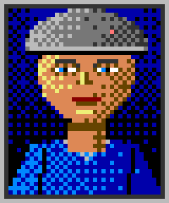
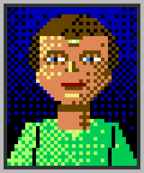
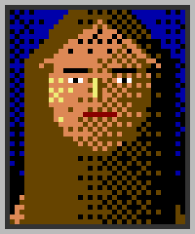

# TICKET-013: Porträts (Art-Style)

**Typ:** Design / Art Direction (Sub-Ticket)
**Epic:** Endzeit-Wirtschaftssimulator – Visuelle Identität
**Priorität:** Mittel-Hoch
**Status:** Entwurf fertig, bereit für Review
**Abhängigkeiten:** TICKET-009 (Hauptticket), TICKET-010 (Generelle
Stilregeln), TICKET-001 (Fraktionen/Mutationen), TICKET-011 (Menü-/
Dialogsystem)
**Geschwistertickets:** TICKET-012, TICKET-014 bis TICKET-017

> **Stilrevision (2026-09-20):** Verbindliche Stilreferenz ist ab sofort der
> C64-Look von *SKALD – Against the Black Priory*: 16-Farben-VIC-II-Palette,
> durchgängiges Bayer-Dithering, tiefschwarze Hintergründe. Die Struktur-,
> Raster- und Systemfestlegungen dieses Tickets gelten unverändert weiter;
> geändert haben sich Palette und Schattierungstechnik (Begründung und
> Regeln: TICKET-009, Abschnitt 20). Aktueller Asset-Satz:
> `design/assets/artstyle-c64/`, Generator: `tools/gen_assets_c64.py`.

## Ziel des Tickets

Visuelle Ausarbeitung der Dialogporträts (Büsten), die im Menü-/
Dialogsystem (siehe TICKET-011, Abschnitt 1 und 5) verwendet werden:
Grundaufbau, fraktionsspezifische Merkmale (inkl. sichtbarer Mutationen aus
TICKET-001), Ausdrucksvarianten sowie Alters- und Statusvarianten. Porträts
sind neben den Charaktersprites (TICKET-014) das wichtigste Mittel, um
individuellen Figuren im ansonsten stark reduzierten Pixel-Art-Stil ein
Gesicht und eine Identität zu geben.

## 0. Verhältnis zu TICKET-011

Porträts existieren nicht isoliert, sondern ausschließlich als Bestandteil
des in TICKET-011 (Abschnitt 1, 3 und 5) beschriebenen Dialogsystems. Der
dort definierte kreisförmige Rahmen, die fraktionsspezifische Rahmenfarbe
und die Positionierung innerhalb des Dialogfensters gelten unverändert
auch für dieses Ticket; hier wird ausschließlich der Bildinhalt der Büste
selbst ausgearbeitet, nicht ihre Einbettung in die Menüoberfläche.

## 1. Referenzmockups: Drei Fraktionsporträts

Drei Beispielporträts wurden bereits erstellt
(`design/assets/artstyle/03a_portrait_bunker.png`,
`03b_portrait_mutant.png`, `03c_portrait_wastelander.png`) im 32×32-Raster
(siehe TICKET-010, Abschnitt 2), jeweils mit Pergamentfarbenem Rahmen (siehe
TICKET-011, Abschnitt 2) und fraktionsspezifischer Kleidungsfarbe im
unteren Bilddrittel. Diese drei Bilder dienen als verbindliche
Stilreferenz für alle weiteren Porträts.

## 1.1 Warum drei Referenzporträts genügen

Die drei erstellten Referenzporträts (Abschnitt 1) decken bewusst genau
eine Figur pro Fraktion ab, nicht mehr. Ziel ist es, mit minimalem aber
klar demonstriertem Aufwand zu zeigen, wie sich die in Abschnitt 3
beschriebene fraktionsspezifische Differenzierung visuell niederschlägt,
bevor im Rahmen der eigentlichen Asset-Produktion (siehe TICKET-009,
Abschnitt 13) die volle, in Abschnitt 14 beschriebene Bandbreite an
Varianten pro Fraktion erstellt wird.

## 2. Grundaufbau eines Porträts

Jedes Porträt gliedert sich in drei vertikale Zonen innerhalb des
32×32-Rasters: Haaransatz/Kopfbedeckung (oberste Zone, ca. 4-5 Pixel Höhe),
Gesicht (mittlere Zone, ca. 10-12 Pixel Höhe, mit Augen und Mund als
einzelne, klar gesetzte dunkle Pixelblöcke statt gezeichneter Linien) und
Kleidung/Schultern (untere Zone, ca. 10 Pixel Höhe, trägt die
fraktionsspezifische Akzentfarbe). Diese feste Dreiteilung erlaubt es,
neue Porträts schnell und konsistent zusammenzusetzen, ähnlich einem
modularen Baukastensystem, ohne dass jedes Porträt komplett neu
durchkomponiert werden müsste.

## 2.1 Verhältnis von Porträt- und Sprite-Proportionen

Da dieselbe Figur sowohl als 32×32-Porträt (dieses Ticket) als auch als
16×24-Ganzkörpersprite (TICKET-014) dargestellt wird, ist auf konsistente
Proportionen zwischen beiden Darstellungen zu achten: Kopfgröße,
Hautfarbe und Kleidungsakzentfarbe müssen zwischen Porträt und Sprite
identisch bleiben, auch wenn der Kopf im Sprite naturgemäß deutlich
kleiner und weniger detailliert ausfällt. Diese Konsistenzanforderung
wird in TICKET-014 (Abschnitt 1) noch einmal aus der Sprite-Perspektive
aufgegriffen.

## 3. Fraktionsspezifische Gesichtsmerkmale

**Bunker-Porträts** nutzen kühlere Hauttöne (Skin-Mid aus TICKET-010,
Abschnitt 1), einheitlich kurz geschnittenes Haar oder eine schlichte
Mütze/Helm-Andeutung (siehe Mockup: Mid-Grey-Kopfbedeckung) und
Kleidungsfarben aus der Blaugruppe. **Mutierten-Porträts** zeigen je nach
individueller Mutation (siehe TICKET-001, Abschnitt 4) sichtbare, aber
dezente Merkmale: Träger des Dritten Auges erhalten einen einzelnen,
zusätzlichen hellen Pixelblock in Toxic-Light an der Stirn/Schläfe (siehe
Mockup-Variante, dort exemplarisch am Kopf angedeutet), Träger der Dritten
Hand benötigen im Porträt selbst keine sichtbare Änderung, da sich diese
Mutation nur an der Hand zeigt (relevant erst bei Ganzkörper-Sprites, siehe
TICKET-014). **Wastelander-Porträts** nutzen wärmere Hauttöne, unregelmäßig
wirkende Frisuren und Kleidung aus der Erdgruppe mit Waste-Rot-Akzent.

## 4. Ausdrucksvarianten

Für zentrale, wiederkehrende Dialogfiguren (z. B. Ratsmitglieder,
Sippenälteste, Ältestenratsmitglieder aus TICKET-002) werden bis zu drei
Ausdrucksvarianten je Porträt vorgesehen: neutral (Standardzustand),
zufrieden/zustimmend (leicht angehobene Mundpartie, ein bis zwei veränderte
Pixel) und misstrauisch/ablehnend (leicht abgesenkte Augenpartie). Diese
Varianten werden, passend zur limitierten Animationsphilosophie aus
TICKET-009 (Abschnitt 5), als drei separate, statische Einzelbilder
vorgehalten und nicht durch weiche Morph-Animation ineinander übergeführt.
Der Wechsel zwischen Varianten erfolgt kontextabhängig während eines
Dialogs (siehe TICKET-011, Abschnitt 5), etwa ein Wechsel zu
"misstrauisch", wenn der Spieler in einer Verhandlung (TICKET-004,
Abschnitt 11) ein unfaires Angebot unterbreitet.

## 5. Alters- und Statusvarianten

Um die in TICKET-007 (Abschnitt 11) beschriebene Alterung von
Bevölkerung sichtbar zu machen, erhalten wiederkehrende Führungsfiguren
optional eine gealterte Porträtvariante (graues statt farbiges Haar,
zusätzliche dunkle Pixelakzente unter den Augen), die nach einem
in-Game-Zeitsprung automatisch die jüngere Variante ersetzt. Zusätzlich
ist eine "geschwächt/krank"-Variante vorgesehen (blassere Hautfarbe durch
Wechsel von Skin-Mid zu einer abgedunkelten Zwischenstufe, siehe TICKET-007
Abschnitt 5: Krankheit/Epidemien), die bei schwerer Erkrankung einer
dargestellten Figur eingeblendet wird.

## 6. Porträts für Randgruppen und Gegner

Für die in TICKET-016 beschriebenen Gegnerfiguren (Räuber, Banden) werden
vereinfachte Porträts ohne die in Abschnitt 3 beschriebenen
Fraktionsmerkmale verwendet: unregelmäßige, oft von Kopfbedeckungen/
Tüchern verdeckte Gesichter (siehe TICKET-016, Abschnitt 1) aus der
Neutral-/Erdgruppe, passend zur in TICKET-010 (Abschnitt 8.1) beschriebenen
bewussten Farblosigkeit von Randgruppen gegenüber den drei
Hauptfraktionen.

## 7. Rahmenintegration mit dem Dialogsystem

Die Porträts werden, wie in TICKET-011 (Abschnitt 1 und 3) beschrieben,
kreisförmig maskiert in den fraktionsspezifischen Rahmenstil eingesetzt.
Wichtig ist dabei, dass die quadratische 32×32-Basis (Abschnitt 2) so
gestaltet ist, dass auch nach kreisförmiger Maskierung keine wichtigen
Gesichtsmerkmale (insbesondere die in Abschnitt 3 beschriebenen
Mutationsmerkmale) an den Bildecken abgeschnitten werden – alle
charakteristischen Details werden daher bewusst zentral im mittleren
70-80% der Bildfläche platziert.

## 8. Wiederverwendbarkeit und Variation

Um nicht für jede in TICKET-007 beschriebene Bevölkerungsfigur ein
komplett individuelles Porträt zu benötigen, wird ein Baukastensystem aus
austauschbaren Kopfbedeckungen, Frisuren, Hauttönen (innerhalb der drei
definierten Abstufungen, TICKET-010 Abschnitt 1) und Kleidungsdetails
vorgesehen, das auf Basis des in Abschnitt 2 beschriebenen dreizonigen
Grundaufbaus eine große Zahl plausibler Variationen erzeugen kann, ohne
dass jede einzelne Kombination von Hand neu gepixelt werden muss. Zentrale,
narrativ wichtige Figuren (siehe TICKET-004, Abschnitt 11; TICKET-005,
Abschnitt 10) erhalten dennoch handgefertigte Unikat-Porträts, um ihre
erzählerische Bedeutung zu unterstreichen.

## 8.1 Grenzen des Baukastensystems

Das in Abschnitt 8 beschriebene Baukastensystem soll ausdrücklich nicht
für die in Abschnitt 15 erwähnten, narrativ zentralen Unikatfiguren
verwendet werden: Ratsmitglieder, Sippen-Älteste und Ältestenrats-
Vertreter, die in mehreren Tickets (TICKET-002, TICKET-004, TICKET-005)
namentlich auftauchen, erhalten aus Gründen der Wiedererkennbarkeit und
erzählerischen Gewichtung stets individuell zusammengestellte, nicht rein
zufallsgenerierte Porträts, auch wenn diese technisch aus denselben
Baukasten-Bausteinen (Abschnitt 8, 13-14) zusammengesetzt werden.

## 9. Zusammenspiel mit anderen Sub-Tickets

Porträts werden primär im Menü-/Dialogsystem (TICKET-011) verwendet,
greifen aber auf dieselbe Fraktionsfarblogik wie Charaktersprites
(TICKET-014) und Gebäude (TICKET-015) zurück, damit ein und dieselbe
Figur in Dialogszene und auf der Hauptkarte (TICKET-012, als kleiner
Sprite) konsistent wiedererkennbar bleibt.

## 10. Mutationsvarianten im Porträt: Vollständige Übersicht

Aufbauend auf TICKET-001 (Abschnitt 4) werden für die Mutierten-Fraktion
folgende porträttaugliche Mutationsvarianten definiert:

| Mutation | Sichtbar im Porträt? | Darstellung |
|---|---|---|
| Drittes Auge | Ja | Zusätzlicher heller Pixelblock (Toxic-Light) an Stirn/Schläfe |
| Dritte Hand | Nein (nicht im Kopfbereich) | Nur in Ganzkörper-Sprites (TICKET-014) sichtbar |
| Toxin-/Strahlenresistenz | Nein | Keine äußerlich sichtbare Änderung |
| Reduzierter Grundumsatz | Nein | Keine äußerlich sichtbare Änderung |
| Verbesserter Geruchs-/Gehörsinn | Optional | Leicht vergrößerte, zusätzlich schattierte Ohrpartie |
| Gesundheitliche Komplikation ohne Vorteil | Ja | Blassere Haut (siehe Abschnitt 5), eingefallene Wangenpartie |

Diese Übersicht stellt sicher, dass die in TICKET-007 (Abschnitt 4)
beschriebene zufällige Mutationsmanifestation bei Nachkommen auch dann
visuell konsistent umsetzbar bleibt, wenn nicht jede der in TICKET-001
beschriebenen Mutationsformen ein eigenes, aufwändiges Porträtdetail
benötigt.

## 11. Augen als primäres Ausdrucksmittel

Da das 32×32-Raster (Abschnitt 2) nur wenig Platz für Mimik bietet,
konzentriert sich der Ausdruck fast vollständig auf die Augenpartie (siehe
Abschnitt 4): Position und Größe der beiden dunklen Pixelblöcke, die die
Augen darstellen, sowie ein bis zwei zusätzliche Pixel darüber (Andeutung
von Augenbrauen) reichen aus, um zwischen neutral, zustimmend und
misstrauisch zu unterscheiden. Diese bewusste Fokussierung auf ein
einziges, klar steuerbares Ausdruckselement ist typisch für Pixel-Art
dieser Auflösungsklasse und wird für alle Porträts, unabhängig von
Fraktion oder Mutation, einheitlich angewendet.

## 12. Vergleich zum Referenzspiel

Burntime nutzte für seine Dialogporträts eine im Verhältnis zur damaligen
Grafikhardware bereits recht hohe Detailtreue mit differenzierten
Gesichtszügen. Für dieses Projekt wird bewusst eine reduziertere,
blockiger wirkende Variante gewählt (siehe TICKET-010, Abschnitt 7), die
näher am gröberen Ende der Amiga-Pixel-Art-Bandbreite liegt. Diese
Entscheidung priorisiert Konsistenz mit den übrigen, ebenfalls stark
reduzierten Assetklassen (Sprites, Icons, siehe TICKET-014, TICKET-017)
gegenüber einer isolierten Detailsteigerung allein bei Porträts, die sonst
stilistisch aus dem Rahmen fallen würden.

## 13. Kleidung als kulturelles Erkennungsmerkmal

Über die reine Fraktionsakzentfarbe (Abschnitt 3) hinaus erhält die
Kleidungszone jedes Porträts kleinere, kulturell motivierte Details, die
an die in TICKET-001 (Abschnitt 6) beschriebene kulturelle Differenzierung
anknüpfen: Bunker-Kleidung zeigt einen schlichten, symmetrischen Kragen
mit angedeutetem Rangabzeichen (ein einzelner heller Pixelpunkt, dessen
Position den Status der Figur andeuten kann), Mutierten-Kleidung zeigt
unregelmäßige, geflochten wirkende Muster in der Akzentfarbe, die an die in
TICKET-001 beschriebenen Sippenlieder und Initiationsriten erinnern sollen,
Wastelander-Kleidung zeigt sichtbare, in einer dunkleren Kontrastfarbe
angedeutete Flicken. Diese Details sind bewusst klein gehalten, um die in
Abschnitt 2 beschriebene Grundstruktur nicht zu überladen.

## 14. Vielfalt innerhalb einer Fraktion

Um zu vermeiden, dass alle Angehörigen einer Fraktion trotz
Baukastensystem (Abschnitt 8) optisch zu homogen wirken, werden für jede
Fraktion mindestens drei unterschiedliche Grundgesichtsformen (schmal,
rundlich, kantig) sowie zwei Hauttonvarianten innerhalb der jeweils
zulässigen Palettengruppe (TICKET-010, Abschnitt 1) vorgesehen. In
Kombination mit den in Abschnitt 4-5 beschriebenen Ausdrucks- und
Statusvarianten sowie der in Abschnitt 8 beschriebenen
Kleidungs-/Frisurenvielfalt ergibt sich eine ausreichend große Bandbreite
plausibler Porträtkombinationen, ohne dass für jede einzelne
Bevölkerungsfigur aus TICKET-007 ein komplett neues Unikat-Porträt
notwendig wäre.

## 15. Produktionschecklist für neue Porträts

Vor Abnahme eines neuen Porträts wird geprüft: Folgt es dem dreizonigen
Grundaufbau (Abschnitt 2)? Verwendet es ausschließlich Palettenfarben aus
der jeweils zulässigen Fraktionsgruppe (TICKET-010, Abschnitt 1)? Bleiben
alle charakteristischen Merkmale (insbesondere Mutationsdetails, siehe
Abschnitt 10) auch nach kreisförmiger Maskierung (Abschnitt 7) sichtbar?
Ist mindestens die neutrale Ausdrucksvariante (Abschnitt 4) vorhanden,
bevor optionale weitere Varianten ergänzt werden? Diese Checkliste
entspricht in ihrer Grundstruktur der projektweiten Konsistenzprüfung aus
TICKET-009 (Abschnitt 9.1).

## 16. Porträts im Verhandlungskontext

Wie in TICKET-011 (Abschnitt 16) am Beispiel einer Verhandlung mit den
Bittergraben-Sippen beschrieben, wechselt das dargestellte Porträt während
eines Dialogs aktiv zwischen den in Abschnitt 4 definierten
Ausdrucksvarianten, um dem Spieler unmittelbares, nonverbales Feedback zu
seinen Entscheidungen zu geben. Diese Kopplung zwischen Verhandlungsstatus
(siehe TICKET-004, Abschnitt 5: Reputationsmechanik) und Porträtausdruck
soll konsequent eingehalten werden: Eine sich verschlechternde Reputation
sollte sich, sofern die aktuelle Verhandlungsperson dargestellt wird,
innerhalb weniger Dialogschritte auch im Gesichtsausdruck niederschlagen,
damit Spieler die Konsequenzen ihres Handelns nicht nur über abstrakte
Zahlenwerte, sondern auch über die auf den ersten Blick lesbare Mimik der
handelnden Figur erfahren.

## 17. Diversität und Repräsentation innerhalb der Grafik-Beschränkungen

Trotz der bewusst geringen Auflösung (Abschnitt 2, 32×32 Pixel) soll die
Porträtgestaltung erkennbare Vielfalt an Alter, Geschlecht und
Erscheinungsbild innerhalb jeder Fraktion abbilden, statt auf ein einziges
"Standardgesicht" pro Fraktion reduziert zu werden. Die in Abschnitt 14
beschriebene Kombination aus Gesichtsform, Hautton, Frisur und Kleidung
wird bewusst so ausgelegt, dass sowohl männlich als auch weiblich gelesene
Figuren sowie unterschiedliche Altersgruppen (siehe TICKET-007, Abschnitt
11: Kinder, Erwachsene, Alte) mit denselben Baukastenelementen plausibel
darstellbar sind, ohne dass eine der drei Fraktionen dabei auf ein
einzelnes, stereotypes Erscheinungsbild reduziert wird.

## 18. Zusammenfassung der Designabsicht

Porträts sind im stark reduzierten Pixel-Art-Stil dieses Projekts das
wichtigste Werkzeug, um aus abstrakten Systemwerten (Reputation aus
TICKET-004, Bedürfnisstatus aus TICKET-007, Mutationsausprägung aus
TICKET-001) ein unmittelbar lesbares, menschliches Gesicht zu machen. Jede
in diesem Ticket getroffene Entscheidung – vom dreizonigen Grundaufbau über
die Mutationsdarstellung bis zur Kopplung von Ausdruck und
Verhandlungsstatus – dient diesem einen Ziel: Spieler sollen die Folgen
ihrer wirtschaftlichen und diplomatischen Entscheidungen nicht nur in
Zahlen, sondern im Gesicht der jeweils betroffenen Figur ablesen können.

## Offene Punkte für Folgetickets

- Konkrete Liste benannter Führungsfiguren mit Unikat-Porträts (siehe
  TICKET-002, TICKET-004, TICKET-005).
- Baukastensystem-Spezifikation (Anzahl Frisuren-/Kleidungsvarianten pro
  Fraktion).
- Technische Umsetzung der kreisförmigen Maskierung (siehe Abschnitt 7).

## 19. Ausblick auf zusätzliche Emotionszustände

Sollte sich im späteren Balancing zeigen, dass die drei Ausdrucksvarianten
aus Abschnitt 4 nicht ausreichen, um die Bandbreite an in TICKET-005
(Abschnitt 11: Moral) und TICKET-007 (Abschnitt 8: Moral/Kultur)
beschriebenen Gemütszuständen abzudecken, können weitere Varianten (z. B.
"verzweifelt" bei sehr niedriger Moral oder "triumphierend" nach einem
Verhandlungserfolg) nach demselben in Abschnitt 11 beschriebenen Prinzip
(Veränderung ausschließlich der Augen-/Augenbrauenpartie) ergänzt werden,
ohne den dreizonigen Grundaufbau aus Abschnitt 2 zu verändern.

Diese Erweiterbarkeit ist bewusst als Reserve angelegt und nicht Teil der
aktuellen Mindestanforderung dieses Tickets, sondern soll lediglich
sicherstellen, dass spätere Balancing-Erkenntnisse nicht zu einem
grundlegenden Neuentwurf des gesamten Porträtsystems zwingen.

## Akzeptanzkriterien

- [x] Dreizoniger Grundaufbau für Porträts definiert.
- [x] Fraktionsspezifische Gesichtsmerkmale inkl. Mutationsdarstellung
      beschrieben.
- [x] Ausdrucks- und Statusvarianten festgelegt.
- [x] Baukastensystem für Bevölkerungsvielfalt skizziert.
- [x] Umfang mindestens 2000 Wörter.

## Beispielgrafiken (C64-Stilrevision)

Vorschau (hochskaliert); native Pixeldateien liegen unter
`design/assets/artstyle-c64/native/`.

