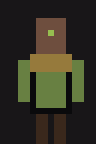

# TICKET-014: Spielfiguren – Fraktionen (Art-Style)

**Typ:** Design / Art Direction (Sub-Ticket)
**Epic:** Endzeit-Wirtschaftssimulator – Visuelle Identität
**Priorität:** Hoch
**Status:** Entwurf fertig, bereit für Review
**Abhängigkeiten:** TICKET-009 (Hauptticket), TICKET-010 (Generelle
Stilregeln), TICKET-001 (Fraktionen/Mutationen), TICKET-013 (Porträts)
**Geschwistertickets:** TICKET-012, TICKET-013, TICKET-015 bis TICKET-017

## Ziel des Tickets

Visuelle Ausarbeitung der Charaktersprites für die drei Hauptfraktionen
(Bunker-Überlebende, Mutierte, Wastelander): Grundposen, Animationssätze
und fraktionsspezifische Silhouettenmerkmale im festgelegten
16×24-Pixelraster (siehe TICKET-010, Abschnitt 2).

## 1. Referenzmockups: Drei Fraktionssprites

Drei Beispielsprites wurden bereits erstellt
(`design/assets/artstyle/04a_sprite_bunker.png`, `04b_sprite_mutant.png`,
`04c_sprite_wastelander.png`), jeweils in stehender Grundpose mit
fraktionstypischer Kleidungsfarbe und einem charakteristischen
Kopfmerkmal (Helm bei Bunker, angedeutetes Drittes Auge bei Mutierten,
Kapuze bei Wastelandern). Wie in TICKET-013 (Abschnitt 2.1) festgelegt,
müssen Hautfarbe und Akzentfarbe zwischen diesen Sprites und den
zugehörigen Porträts konsistent bleiben.

## 1.1 Verhältnis zu TICKET-013

Da Porträt (TICKET-013) und Ganzkörpersprite (dieses Ticket) stets
dieselbe Figur darstellen können, gilt die in TICKET-013 (Abschnitt 2.1)
festgelegte Konsistenzanforderung auch in umgekehrter Richtung: Jede in
diesem Ticket neu eingeführte Fraktionsfarbe oder Mutationsdarstellung
(Abschnitt 4) muss mit der entsprechenden Porträtdarstellung übereinstimmen,
und umgekehrt darf keine neue Porträtvariante aus TICKET-013 eingeführt
werden, ohne zu prüfen, ob sie sich konsistent auf ein Ganzkörpersprite
nach den Regeln dieses Tickets übertragen lässt.

## 2. Grundaufbau eines Charaktersprites

Jedes Sprite gliedert sich, wie in TICKET-009 (Abschnitt 4) gefordert, in
klar getrennte Blockformen: Kopf (oberste Zone), Torso mit Akzentstreifen
im oberen Torso-Drittel (mittlere Zone, trägt die Hauptkleidungsfarbe und
eine schmale Akzentfarbfläche zur Fraktionskennzeichnung), Arme (seitlich
angesetzt, in Kleidungsfarbe) und Beine (unterste Zone, einheitlich in
Brown-Dark für alle Fraktionen, um Wiederverwendbarkeit von
Lauf-Frames zu erleichtern, siehe Abschnitt 5). Dieser Aufbau folgt exakt
dem in TICKET-010 (Abschnitt 13) beschriebenen Produktionsdurchlauf.

## 3. Bunker-Charaktersprite

Der Bunker-Sprite (siehe Mockup) trägt eine stahlblaue Uniform
(Bunker-Blau als Hauptfarbe, Bunker-Steel als Akzentstreifen) sowie einen
schlichten Helm (Bunker-Steel) anstelle sichtbarer Haare. Die Silhouette
ist bewusst gerade und symmetrisch gehalten, um die in TICKET-001
beschriebene disziplinierte, uniforme Organisation der Bunker-Gesellschaft
auch visuell zu unterstreichen. Rangunterschiede (siehe TICKET-003,
Abschnitt 10: Zunftausbildung) werden durch kleine, zusätzliche
Akzentpunkte am Kragen dargestellt, nicht durch grundlegend andere
Silhouetten.

## 4. Mutierten-Charaktersprite

Der Mutierten-Sprite (siehe Mockup) trägt olivgrüne, unregelmäßiger
wirkende Kleidung (Mutant-Green/Mutant-Ochre) und zeigt bei Trägern des
Dritten Auges einen einzelnen hellen Pixelakzent (Toxic-Light) am Kopf,
konsistent mit der in TICKET-013 (Abschnitt 3 und 10) beschriebenen
Mutationsdarstellung im Porträt. Träger der Dritten Hand erhalten eine
zusätzliche, etwas kräftiger gezeichnete Hand/Unterarm-Silhouette an
einer Körperseite (ein zusätzlicher, leicht versetzter Pixelblock neben
der regulären Hand), die auch in kleiner Kartendarstellung (siehe
TICKET-012, Abschnitt 9) noch als charakteristisches Detail erkennbar
bleibt.

## 5. Wastelander-Charaktersprite

Der Wastelander-Sprite (siehe Mockup) trägt sandbraune, geflickt wirkende
Kleidung (Waste-Tan/Waste-Red) und eine einfache Kapuze oder ein
Kopftuch (Brown-Dark) statt einheitlicher Uniform oder Mutationsmerkmalen.
Die Silhouette ist bewusst unregelmäßiger und "improvisierter" gestaltet
als die der Bunker-Fraktion (siehe Abschnitt 3), etwa durch leicht
asymmetrisch angeordnete Kleidungsakzente, passend zur in TICKET-001
beschriebenen improvisierten Lebensweise dieser Fraktion.

## 5.1 Silhouetten-Test bei minimaler Größe

Da alle drei Fraktionssprites (Abschnitt 3-5) auch in der stark
verkleinerten Kartensymbolik (siehe TICKET-012, Abschnitt 9) erkennbar
bleiben müssen, wird für jedes neue Sprite ein einfacher Silhouettentest
empfohlen: Verkleinerung auf etwa ein Viertel der nativen Größe und
Prüfung, ob die jeweils charakteristischen Merkmale (Helm bei Bunker,
Drittes-Auge-Akzent bei Mutierten, Kapuze bei Wastelandern) noch als
unterscheidbarer Farbfleck erkennbar sind. Besteht ein Sprite diesen Test
nicht, ist die Akzentfläche (Abschnitt 2) zu vergrößern oder zu
vereinfachen, bevor es in die Produktionspipeline übernommen wird.

## 6. Animationssätze

Für jede Fraktion wird derselbe Satz an Basisanimationen vorgesehen,
jeweils im 2-4-Frame-Limit aus TICKET-009 (Abschnitt 5): Idle (1 Frame,
leichte Variation der Armhaltung alle paar Sekunden), Gehen (3 Frames:
Grundstellung, Bein vor, Bein zurück), Arbeiten/Handwerk (2 Frames für
generische Werkzeugbenutzung, siehe TICKET-003), Kampfangriff (2 Frames:
Ausholen, Treffer, siehe TICKET-005) sowie Getroffen/Niedergehen (2
Frames). Diese Standardisierung über alle drei Fraktionen hinweg
erleichtert die Produktion erheblich, da nur die in Abschnitt 3-5
beschriebenen Farb- und Silhouettendetails zwischen den Fraktionen
variieren, nicht die grundlegende Animationslogik.

## 7. Fraktionsspezifische Sonderanimationen

Zusätzlich zu den in Abschnitt 6 beschriebenen Basisanimationen erhält
jede Fraktion eine charakteristische Sonderanimation, die ihre in
TICKET-001 und TICKET-005 beschriebene Spielweise visuell unterstreicht:
Bunker-Sprites erhalten eine "Nachladen"-Animation (2 Frames, betont
Ausrüstungsvorteil, siehe TICKET-005, Abschnitt 5), Mutierten-Sprites eine
"Fallenstellen"-Animation (2 Frames, kniende Haltung, siehe TICKET-005,
Abschnitt 5: Guerilla-Taktik), Wastelander-Sprites eine
"Ernte"-Animation (2 Frames, bückende Haltung, siehe TICKET-003,
Abschnitt 4: Wastelander-Wirtschaftsprofil).

## 8. Ausrüstungs- und Statusvarianten

Charaktersprites können, angelehnt an TICKET-006 (Technologiestufen),
sichtbare Ausrüstungsverbesserungen erhalten: Ein Bunker-Charakter mit
Tier-2-Waffentechnologie (siehe TICKET-006, Abschnitt 3) erhält ein
sichtbar größeres, deutlicher gezeichnetes Waffen-Sprite in der Hand,
ohne dass sich die restliche Silhouette ändert. Verwundete oder erkrankte
Charaktere (siehe TICKET-007, Abschnitt 13) erhalten eine leicht
abgedunkelte Hautfarbvariante, analog zur in TICKET-013 (Abschnitt 5)
beschriebenen Porträt-Statusvariante, um Konsistenz zwischen beiden
Darstellungsformen zu wahren.

## 8.1 Sichtbarkeit von Technologiestufen am Charakter

Ergänzend zu Abschnitt 8: Da TICKET-006 vier Technologiestufen (Tier 0-3)
definiert, wird empfohlen, nicht jede einzelne Stufe visuell zu
unterscheiden, sondern nur an den Übergängen Tier 1→2 und Tier 2→3 ein
sichtbar verändertes Ausrüstungsdetail zu zeigen (z. B. ein zusätzlicher
Pixelakzent am Werkzeug/an der Waffe). Diese bewusste Vereinfachung
verhindert eine unübersichtliche Zahl an optisch kaum unterscheidbaren
Zwischenstufen und hält sich an das in TICKET-010 (Abschnitt 1.1)
beschriebene Prinzip der Farb- und Detailsparsamkeit.

## 9. Randgruppen-Sprites (Überleitung zu TICKET-016)

Sprites für Randgruppen (Deserteure, Banden, siehe TICKET-005, Abschnitt
8) folgen demselben Grundaufbau (Abschnitt 2), verzichten aber, wie in
TICKET-010 (Abschnitt 8.1) festgelegt, auf eine feste Fraktionsakzentfarbe
und nutzen ausschließlich Neutral-/Erdgruppentöne. Die konkrete
Ausarbeitung dieser Sprites erfolgt in TICKET-016.

## 9.1 Abgrenzung der Randgruppen-Silhouette

Damit Randgruppen (Abschnitt 9) auf den ersten Blick von regulären
Fraktionsmitgliedern unterscheidbar bleiben, erhalten ihre Sprites zusätzlich
zur Farblosigkeit (TICKET-010, Abschnitt 8.1) eine bewusst unregelmäßigere,
asymmetrische Silhouette (z. B. ein schräg sitzendes Kleidungsstück oder
ein fehlendes Ausrüstungsteil), die sich deutlich von der jeweils
symmetrischeren oder klar gegliederten Silhouette der drei Hauptfraktionen
(Abschnitt 3-5) abhebt.

## 10. Zusammenspiel mit anderen Sub-Tickets

Charaktersprites erscheinen sowohl in Detailszenen (Siedlungsübersicht,
Kampfszenen, siehe TICKET-011, Abschnitt 17) als auch stark verkleinert auf
der Hauptkarte (TICKET-012, Abschnitt 9) und müssen in beiden Kontexten
konsistent mit den zugehörigen Porträts (TICKET-013) und Items/Waffen
(TICKET-017) erscheinen.

## 11. Blickrichtungen und Bewegung auf der Karte

Für die Halbdraufsicht-Perspektive aus TICKET-010 (Abschnitt 10) werden pro
Charakter vier Blickrichtungsvarianten vorgesehen: vorne, hinten, links,
rechts, wobei links/rechts durch einfache horizontale Spiegelung
desselben Sprites erzeugt werden, um den Produktionsaufwand zu halbieren.
Auf der stark verkleinerten Hauptkarte (siehe TICKET-012, Abschnitt 9)
werden Charaktere jedoch, analog zu den dortigen Siedlungssymbolen, nur
als einheitliches, richtungsloses Symbol dargestellt – die vollen
Blickrichtungsvarianten kommen ausschließlich in Detailszenen (TICKET-011,
Abschnitt 17) zum Tragen.

## 12. Gruppendarstellung auf der Hauptkarte

Größere Gruppen (Milizen, Karawanenbegleitung, siehe TICKET-005, Abschnitt
4 und TICKET-004, Abschnitt 7) werden auf der Hauptkarte nicht als viele
einzelne Sprites, sondern als ein einzelnes, etwas größeres
Gruppen-Icon dargestellt, das aus zwei bis drei leicht überlappend
angeordneten, verkleinerten Charaktersilhouetten der jeweiligen Fraktion
besteht. Dies vermeidet visuelle Überladung der Kartenansicht bei
größeren Konflikten (siehe TICKET-005, Abschnitt 13: Belagerung) und hält
sich an das in TICKET-009 (Abschnitt 6) beschriebene Prinzip einer
schematischen, nicht überladenen Kartendarstellung.

## 13. Individuelle Farbvariation innerhalb einer Fraktion

Um einzelne, dem Spieler namentlich bekannte Charaktere (z. B. eine
bestimmte Karawanenführerin, siehe TICKET-004, Abschnitt 11) von generischen
Bevölkerungssprites zu unterscheiden, wird eine kleine, zusätzliche
Akzentfarbvariation innerhalb der jeweils zulässigen Fraktionsfarbgruppe
zugelassen (z. B. ein etwas dunklerer oder hellerer Blauton bei
Bunker-Sprites), die sich immer noch klar als "Bunker-Fraktion" lesen
lässt, aber eine gewisse individuelle Wiedererkennung ermöglicht, ohne dem
in TICKET-010 (Abschnitt 1.1) beschriebenen Prinzip der
Farbsparsamkeit zu widersprechen.

## 14. Interaktion mit Gebäuden

Wenn ein Charaktersprite ein Gebäude betritt oder verlässt (siehe
TICKET-015), wird dies nicht durch eine echte Ein-/Austrittsanimation
dargestellt, sondern durch ein einfaches, hartes Ein-/Ausblenden an der
Gebäudetür-Position, passend zur limitierten Animationsphilosophie aus
TICKET-009 (Abschnitt 5). Diese bewusst einfache Lösung vermeidet
komplexe Verdeckungsberechnungen zwischen Charakter- und
Gebäude-Sprites, die in einem so stark reduzierten Pixelraster ohnehin
kaum sauber darstellbar wären.

## 15. Beispielhafter Produktionsdurchlauf: Gehanimation

Analog zum in TICKET-010 (Abschnitt 13) beschriebenen Produktionsbeispiel
hier ein konkretes Beispiel für die Gehanimation (Abschnitt 6) eines
Wastelander-Sprites: Ausgehend von der stehenden Grundpose (Mockup
`04c_sprite_wastelander.png`) wird zunächst ein zweiter Frame erzeugt, bei
dem das linke Bein zwei Pixel nach vorne und das rechte Bein zwei Pixel
nach hinten verschoben wird, während Kopf und Torso unverändert bleiben.
Ein dritter Frame spiegelt diese Beinstellung. Durch schnelles Abspielen
dieser drei Frames (Grundstellung, Frame 2, Grundstellung, Frame 3) im
Wechsel entsteht der komplette Gehzyklus. Arme werden dabei gegenläufig
zu den Beinen leicht mitbewegt, jedoch ebenfalls nur in ganzen
Pixel-Schritten, nie mit weicher Zwischenposition, um dem
Nearest-Neighbor-Rendering aus TICKET-009 (Abschnitt 2) zu entsprechen.

## 16. Zusammenfassung der Designabsicht

Charaktersprites sind die am häufigsten sichtbaren, sich bewegenden
Elemente des gesamten Spiels und müssen daher besonders konsequent den in
TICKET-009 und TICKET-010 festgelegten Prinzipien folgen: klare
Silhouette statt Detail, Fraktionskennung über Akzentfarbe, limitierte,
aber wirkungsvolle Animation. Jede in diesem Ticket getroffene
Entscheidung – vom gemeinsamen Grundaufbau über die
Blickrichtungslogik bis zur Gruppendarstellung – zielt darauf ab, dass
Spieler auch bei sehr kleiner Darstellung auf der Hauptkarte (TICKET-012)
sofort erkennen können, welcher der drei Fraktionen aus TICKET-001 eine
bestimmte Figur oder Gruppe angehört.

## 17. Rollenvarianten innerhalb einer Fraktion

Über die generische Grundsilhouette (Abschnitt 2-5) hinaus erhält jede
Fraktion einige rollenspezifische Sprite-Varianten, die für bestimmte, in
den Systemtickets beschriebene Tätigkeiten stehen: Ein Bunker-Techniker
(siehe TICKET-006, Abschnitt 3) trägt statt des Helms (Abschnitt 3) eine
Schutzbrille-Andeutung (ein zusätzlicher heller Pixelstreifen über den
Augen), ein Mutierten-Kundschafter (siehe TICKET-006, Abschnitt 11) trägt
eine zusätzliche, dunklere Umhang-Silhouette für Tarnung in kontaminierten
Zonen, ein Wastelander-Milizionär (siehe TICKET-005, Abschnitt 5) erhält
ein sichtbares, improvisiertes Schutzelement (z. B. eine zusätzliche,
dunkle Fläche auf der Brust, die eine notdürftige Panzerung andeutet).
Diese Rollenvarianten teilen sich weiterhin dieselbe Grundfarbpalette und
Silhouette ihrer Fraktion (Abschnitt 3-5), unterscheiden sich aber in
kleinen, klar erkennbaren Zusatzdetails.

## 18. Körperformvarianz

Um nicht alle Angehörigen einer Fraktion auf eine einzige Körpersilhouette
zu reduzieren, werden analog zur in TICKET-013 (Abschnitt 14) beschriebenen
Porträtvielfalt auch für Charaktersprites zwei bis drei leicht
unterschiedliche Körperproportionen vorgesehen (schmaler, durchschnittlich,
kräftiger gebaut), die sich lediglich in der Torso- und Armbreite um ein
bis zwei Pixel unterscheiden, ohne das gemeinsame 16×24-Grundraster
(Abschnitt 2) zu verlassen. Diese Varianz wird, wie in TICKET-013
beschrieben, mit Alters- und Geschlechtervielfalt kombiniert, um innerhalb
der durch die niedrige Auflösung gesetzten Grenzen ein möglichst
lebendiges Bild der jeweiligen Fraktionsbevölkerung (siehe TICKET-007) zu
erzeugen.

## 19. Vergleich zur Kampfdarstellung im Referenzspiel

Burntime stellte Kämpfe primär textbasiert bzw. über einfache
Statusanzeigen dar, nicht über animierte Sprite-Duelle. Für dieses Projekt
wird ein Mittelweg gewählt: Die in Abschnitt 6-7 beschriebenen
Kampfanimationen (Angriff, Getroffen) werden zwar visuell dargestellt, aber
bewusst kurz und schematisch gehalten (siehe TICKET-009, Abschnitt 5),
sodass der eigentliche Kampfausgang weiterhin primär über die in TICKET-005
beschriebenen textuellen Ereignisberichte (siehe TICKET-008, Abschnitt 9)
vermittelt wird. Die Sprite-Animation dient damit eher der atmosphärischen
Untermalung als der vollständigen visuellen Kampfsimulation.

## 20. Zusammenspiel mit dem Bevölkerungssystem

Da TICKET-007 Bevölkerung nach Altersgruppen gliedert (Kinder, Erwachsene,
Alte), werden für Kinder eigene, kleinere Sprite-Varianten (ca. 12×18 statt
16×24 Pixel) mit vereinfachter, kindlicher Proportion vorgesehen, die
dieselbe Fraktionsfarblogik (Abschnitt 3-5) nutzen, jedoch keine
Rollenvarianten (Abschnitt 17) oder Kampfanimationen (Abschnitt 6) erhalten,
da Kinder gemäß TICKET-007 nicht als reguläre Arbeits- oder Kampfeinheiten
eingesetzt werden. Alte Charaktere nutzen die reguläre 16×24-Größe, erhalten
aber, analog zur Porträt-Alterungsvariante aus TICKET-013 (Abschnitt 5),
eine leicht gebeugtere Grundhaltung als zusätzliche Idle-Pose.

## Offene Punkte für Folgetickets

- Vollständiges Frame-Set für alle in Abschnitt 6-7 beschriebenen
  Animationen (Produktionsdetail).
- Sprite-Sheet-Layout und Padding-Konvention (siehe TICKET-010, Abschnitt
  12).
- Liste konkreter Ausrüstungsvarianten je Technologiestufe (Verknüpfung
  mit TICKET-006).

## 21. Produktionsreihenfolge und Priorisierung

Angesichts der in diesem Ticket beschriebenen Variantenvielfalt (Rollen,
Körperformen, Blickrichtungen, Altersgruppen) wird für die spätere
Asset-Produktion eine klare Priorisierung empfohlen: zunächst die drei
generischen Grundsprites (Abschnitt 3-5) inklusive Basisanimationen
(Abschnitt 6) in einer einzigen Blickrichtung fertigstellen, danach die
gespiegelten Blickrichtungsvarianten (Abschnitt 11) ergänzen, erst
anschließend Rollenvarianten (Abschnitt 17), Körperformvarianz (Abschnitt
18) und Kinder-/Alten-Sprites (Abschnitt 20) produzieren. Diese Reihenfolge
stellt sicher, dass bereits nach einer frühen Produktionsphase ein
lauffähiger, wenn auch noch nicht vollständig variantenreicher Prototyp
existiert, an dem sich die in TICKET-009 (Abschnitt 9.1) beschriebene
Konsistenzprüfung frühzeitig durchführen lässt.

## Akzeptanzkriterien

- [x] Grundaufbau für Charaktersprites im 16×24-Raster definiert.
- [x] Drei fraktionsspezifische Sprites mit Silhouetten- und
      Farblogik ausgearbeitet.
- [x] Animationssätze (Basis + Sonderanimationen) definiert.
- [x] Ausrüstungs-/Statusvarianten beschrieben.
- [x] Umfang mindestens 2000 Wörter.

## Beispielgrafiken

