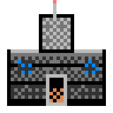
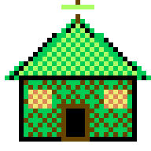
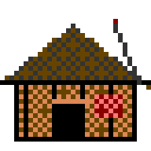
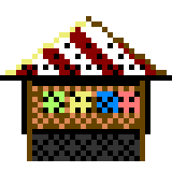

# TICKET-015: Gebäude – Fraktionen & neutral (Art-Style)

**Typ:** Design / Art Direction (Sub-Ticket)
**Epic:** Endzeit-Wirtschaftssimulator – Visuelle Identität
**Priorität:** Hoch
**Status:** Entwurf fertig, bereit für Review
**Abhängigkeiten:** TICKET-009 (Hauptticket), TICKET-010 (Generelle
Stilregeln), TICKET-002 (Karte/Siedlungen), TICKET-003
(Produktionsgebäude)
**Geschwistertickets:** TICKET-012 bis TICKET-014, TICKET-016, TICKET-017

> **Stilrevision (2026-09-20):** Verbindliche Stilreferenz ist ab sofort der
> C64-Look von *SKALD – Against the Black Priory*: 16-Farben-VIC-II-Palette,
> durchgängiges Bayer-Dithering, tiefschwarze Hintergründe. Die Struktur-,
> Raster- und Systemfestlegungen dieses Tickets gelten unverändert weiter;
> geändert haben sich Palette und Schattierungstechnik (Begründung und
> Regeln: TICKET-009, Abschnitt 20). Aktueller Asset-Satz:
> `design/assets/artstyle-c64/`, Generator: `tools/gen_assets_c64.py`.

## Ziel des Tickets

Visuelle Ausarbeitung der Gebäudesprites für alle drei Fraktionen sowie
neutraler Bauten (Aarbrück), im 32×28-Grundraster (siehe TICKET-010,
Abschnitt 2), inklusive Sonderformat für große Gebäude (48×36 px).
Gebäude sind sowohl auf der Hauptkarte (TICKET-012) als auch in der
Siedlungsübersicht (TICKET-011, Abschnitt 17) sichtbar und müssen in
beiden Kontexten funktionieren.

## 0. Verhältnis zu TICKET-002 und TICKET-003

Dieses Ticket übersetzt zwei unterschiedliche vorherige Tickets in
konkrete Grafik: die geografische und narrative Realität einzelner,
namentlich benannter Gebäude aus TICKET-002 (Staudamm, Lange Brücke,
Bunkeranlagen) sowie die funktionalen Produktionsgebäudetypen aus
TICKET-003 (Mühle, Schmiede, Werkstatt, Chemielabor). Beide Quellen
werden hier erstmals in ein gemeinsames visuelles System überführt, ohne
dass eine der beiden Vorgaben verändert oder neu interpretiert wird.

## 1. Referenzmockups: Vier Gebäudetypen

Vier Beispielgebäude wurden bereits erstellt
(`design/assets/artstyle/05a_gebaeude_bunker.png`,
`05b_gebaeude_mutant.png`, `05c_gebaeude_wastelander.png`,
`05d_gebaeude_neutral_aarbrueck.png`), die jeweils eine fraktionstypische
Grundform (siehe Abschnitt 2) mit charakteristischer Dachform und
Akzentfarbe kombinieren.

## 1.1 Warum vier statt drei Grundformen

Zusätzlich zu den drei Fraktionsformen wird bewusst eine vierte, neutrale
Grundform (Aarbrück-Markt) definiert, obwohl das Setting nur drei
Hauptfraktionen kennt (siehe TICKET-001). Grund dafür ist die zentrale
Sonderrolle Aarbrücks als einziger neutraler Handelsort (siehe TICKET-002,
Abschnitt 5 und TICKET-004, Abschnitt 6): Ohne eine eigenständige,
erkennbar "fraktionslose" Gebäudeform würde die Stadt visuell fälschlich
einer der drei Fraktionen zugeordnet erscheinen, was ihrer im
Handelssystem zentralen neutralen Funktion widerspräche und ihre in TICKET-004 beschriebene Vermittlerrolle
grafisch untergraben würde.

## 2. Grundformen je Fraktion

**Bunker-Gebäude** (siehe Mockup): flache, blockige Grundform mit
sichtbarem Antennen-/Lüftungsturm, stahlblauer Akzentstreifen als
"verstärktes Band", dunkler, rechteckiger Eingang – repräsentativ für die
in TICKET-002 (Abschnitt 3) beschriebenen Bunkeranlagen. **Mutierten-
Gebäude ("Sippenhaus")**: einfaches Giebeldach in Brown-Dark über einer
geditherten Wand aus Mutant-Green/Ochre-Mischung, unregelmäßigere
Kantenpixel als bei Bunker-Gebäuden, passend zur organischeren
Gesellschaftsstruktur (siehe TICKET-001, Abschnitt 4). **Wastelander-
Gebäude ("Wastehut")**: spitzeres, sichtbar improvisiertes Dach, Wand aus
Waste-Tan mit Waste-Red-Akzentstreifen im oberen Wandbereich,
asymmetrisch wirkende Kantenpixel. **Neutrales Gebäude (Aarbrück-
Markt)**: breite Grundform mit spitzem, hellerem Dach und mehreren
vertikalen Stützpfeilern in Akzentfarbe, die eine offene Markthalle
andeuten, in neutraler Pergament-/Rostfarbe statt einer
Fraktionsakzentfarbe.

## 3. Sonderformat für große Gebäude

Strategisch bedeutende Bauten (siehe TICKET-002, Abschnitt 3: Bastion
Nord, Regierungsbunker Kessingen-Tief; TICKET-002, Abschnitt 8: Staudamm)
werden im größeren 48×36-Raster (siehe TICKET-010, Abschnitt 2)
dargestellt, das denselben Grundformen wie in Abschnitt 2 folgt, jedoch
zusätzliche Details erlaubt (z. B. mehrere Antennenmasten bei Bastion
Nord, zwei Turbinen-Kreise beim Staudamm, siehe TICKET-012, Abschnitt 12).
Dieses Sonderformat wird sparsam eingesetzt, um die in TICKET-009
(Abschnitt 4) geforderte Silhouetten-Klarheit nicht durch zu viele
großformatige Sonderfälle zu verwässern.

## 3.1 Auswahl der Sonderformat-Gebäude

Nicht jedes große Gebäude aus TICKET-002 erhält automatisch das
48×36-Sonderformat aus Abschnitt 3. Die Auswahl orientiert sich an der in
TICKET-002 (Abschnitt 3, 7 und 8) beschriebenen strategischen Bedeutung:
Gebäude, die in mehreren Systemtickets namentlich als umkämpft oder
zentral beschrieben werden (Staudamm in TICKET-002/TICKET-005, Bastion
Nord in TICKET-002/TICKET-006), erhalten das Sonderformat; rein lokal
bedeutsame Gebäude (einzelne Kornweiler-Gehöfte) bleiben im
Standardformat aus Abschnitt 2, selbst wenn sie in TICKET-002 namentlich
erwähnt werden.

## 4. Statusdarstellung an Gebäuden

Produktionsgebäude (siehe TICKET-003) zeigen ihren aktuellen Status über
ein kleines, über dem Gebäude schwebendes Ein-Frame-Icon (siehe TICKET-011,
Abschnitt 17): ein Zahnrad-Icon bei aktiver Produktion, ein
Ausrufezeichen-Icon bei blockierter Produktionskette (siehe TICKET-003,
Abschnitt 1), eine Flamme bei Beschädigung durch Konflikt (siehe
TICKET-005, Abschnitt 7: Kriegsfolgen). Diese Icons nutzen dieselbe
16×16-Ikonografie wie die Item-Icons aus TICKET-017, um visuelle
Konsistenz zwischen Gebäude- und Warenebene zu wahren.

## 4.1 Prioritätsreihenfolge bei mehreren gleichzeitigen Statusicons

Sollten an einem Gebäude gleichzeitig mehrere Statusbedingungen aus
Abschnitt 4 vorliegen (z. B. blockierte Produktion und gleichzeitige
Kriegsschäden), wird nur das schwerwiegendste Icon angezeigt, in der
Reihenfolge Beschädigung vor Blockade vor aktiver Produktion. Diese feste
Priorität verhindert visuelle Überladung einzelner Gebäude mit mehreren
gleichzeitig eingeblendeten Symbolen.

## 5. Technologiestufen-Sichtbarkeit an Gebäuden

Analog zu TICKET-014 (Abschnitt 8.1) werden auch bei Gebäuden nur die
Übergänge zwischen Technologiestufen (siehe TICKET-006, Abschnitt 2)
visuell markiert: Ein Tier-2-Bunker-Produktionsgebäude erhält ein
zusätzliches, sichtbares Rohrleitungselement an der Fassade, ein
Tier-3-Gebäude zusätzlich einen kleinen, leuchtenden Fenster-Akzent
(Off-White statt Dunkel), der andeutet, dass dieses Gebäude über eine
funktionierende, fortschrittlichere Energieversorgung verfügt (siehe
TICKET-006, Abschnitt 3: Bunker-Energietechnologie).

## 6. Beschädigungs- und Wiederaufbau-Darstellung

Konsistent mit TICKET-005 (Abschnitt 7: Kriegsfolgen und Wiederaufbau)
erhalten beschädigte Gebäude eine sichtbar reduzierte Darstellung: fehlende
Dachteile (ersetzt durch eine dunkle, unregelmäßige Lücke), rußgeschwärzte
Wandflächen (Wechsel einzelner Palettenfarben zu Near-Black-Dithering) und
ein optionales Rauchsymbol darüber. Der Wiederaufbau erfolgt nicht als
kontinuierliche Animation, sondern als eine Abfolge von zwei bis drei
diskreten Baustufen (stark beschädigt → teilrepariert → vollständig
wiederhergestellt), die bei Erreichen des jeweiligen Baufortschritts
(siehe TICKET-003, Abschnitt 13: Wirtschaftliche Skalierung) hart
ausgetauscht werden.

## 6.1 Grenzen der Wiederaufbau-Visualisierung

Die in Abschnitt 6 beschriebenen drei Baustufen gelten als verbindliche
Obergrenze für die Visualisierung von Wiederaufbau, auch wenn TICKET-005
(Abschnitt 7) grundsätzlich einen kontinuierlichen wirtschaftlichen
Wiederaufbauprozess beschreibt. Diese bewusste Vereinfachung von einem
stufenlosen wirtschaftlichen Fortschritt auf drei sichtbare Baustufen folgt
demselben Prinzip wie die in TICKET-014 (Abschnitt 8.1) beschriebene
Reduktion von Technologiestufen auf sichtbare Übergänge und verhindert eine
unübersichtliche Zahl kaum unterscheidbarer Zwischenzustände.

## 7. Neutrale Sonderbauten in Aarbrück

Über den in Abschnitt 2 beschriebenen Standard-Markttyp hinaus erhält
Aarbrück (siehe TICKET-002, Abschnitt 5; TICKET-004, Abschnitt 6) weitere
neutrale Sonderbauten: das Ältestenratsgebäude (etwas größer, mit
zusätzlicher Fahnenstange in neutraler Pergamentfarbe), das
Treuhandlager für Aarbrücker Vermittlungsgeschäfte (siehe TICKET-004,
Abschnitt 11, mit sichtbaren, verschlossenen Lagertoren) sowie die Lange
Brücke selbst (siehe TICKET-002, Abschnitt 8), die als begehbares
Karten-Tile-Element (nicht als klassisches Gebäude-Sprite) im selben
Rost-/Brauntonschema umgesetzt wird.

## 8. Gebäudedichte und Siedlungsgröße

Die Anzahl gleichzeitig dargestellter Gebäude-Sprites in der
Siedlungsübersicht (siehe TICKET-011, Abschnitt 17) variiert mit der in
TICKET-007 (Abschnitt 15) beschriebenen Bevölkerungsobergrenze einer
Siedlung: kleinere Außenposten (z. B. Falkenscharte, siehe TICKET-002,
Abschnitt 3) zeigen nur zwei bis drei Gebäude-Sprites, größere Zentren
(Bastion Nord, Aarbrück) bis zu acht bis zehn. Diese Skalierung ist rein
darstellerisch und beeinflusst nicht die zugrunde liegende
Wirtschaftssimulation aus TICKET-003.

## 8.1 Verhältnis von Siedlungsgröße und Kartendarstellung

Die in Abschnitt 8 beschriebene Gebäudedichte wirkt sich auch auf die
Kartendarstellung (TICKET-012, Abschnitt 5) aus: Größere Siedlungen
erhalten dort ein leicht größeres Icon (siehe TICKET-002, Abschnitt 5, wo
Bastion Nord und Silo 12 bereits unterschiedliche Bevölkerungsgrößen
zugeschrieben werden), das indirekt die in diesem Abschnitt beschriebene
höhere Gebäudezahl der Siedlungsübersicht widerspiegelt, ohne dass auf der
Hauptkarte selbst einzelne Gebäude dargestellt werden müssten.

## 9. Zusammenspiel mit anderen Sub-Tickets

Gebäude-Icons erscheinen verkleinert auf der Hauptkarte (TICKET-012,
Abschnitt 5) und vollständig aufgelöst in der Siedlungsübersicht
(TICKET-011, Abschnitt 17), müssen also, wie in TICKET-010 (Abschnitt 15)
beschrieben, in zwei Detailstufen vorgehalten werden.

## 10. Unterscheidung mehrerer Produktionsgebäude derselben Fraktion

Da eine einzelne Fraktion mehrere unterschiedliche Produktionsgebäudetypen
besitzt (siehe TICKET-003, Abschnitt 3: Mühle, Schmiede, Werkstatt,
Chemielabor je nach Fraktion), reicht die reine Grundform aus Abschnitt 2
nicht aus, um sie voneinander zu unterscheiden. Zusätzlich zur
Fraktionsgrundform erhält jedes Produktionsgebäude ein kleines,
charakteristisches Zusatzdetail: ein Schornstein-Element bei der Schmiede,
ein Wasserrad-Element bei der Mühle, ein Regallager-Fenster bei der
Werkstatt. Diese Zusatzdetails folgen, wie in TICKET-010 (Abschnitt 8)
beschrieben, demselben Prinzip wie bei Charaktersprites: gemeinsame
Grundform plus kleines, eindeutiges Unterscheidungsmerkmal statt komplett
neu entworfener Silhouetten pro Gebäudetyp.

## 11. Fenster, Türen und Detailelemente

Türen werden bei allen Gebäudetypen als dunkle, rechteckige Aussparung
(siehe Mockups) dargestellt, deren Breite proportional zur Gebäudegröße
skaliert. Fenster erhalten, sofern vorhanden, eine kleine, helle
Akzentfläche (Off-White oder eine gedimmte Variante der
Fraktionsakzentfarbe bei Nacht/Beleuchtung), die bei Bunker-Gebäuden
regelmäßig und symmetrisch angeordnet ist, bei Mutierten- und
Wastelander-Gebäuden hingegen unregelmäßiger platziert wird, um die in
TICKET-002 beschriebene improvisierte Bauweise dieser Fraktionen (siehe
TICKET-002, Abschnitt 4 und 5) auch im Detail zu unterstreichen.

## 12. Wetter- und Witterungseinfluss auf Gebäude

Analog zur in TICKET-012 (Abschnitt 16) beschriebenen Wetterdarstellung
auf der Hauptkarte erhalten Gebäude im Winterhalbjahr eine leichte
Schneeauflage auf Dachflächen (Off-White-Dithering am oberen Dachrand,
siehe TICKET-012, Abschnitt 11: saisonale Terrain-Varianten), während
Gebäude in der Nähe von Kontaminationszonen (siehe TICKET-002, Abschnitt
2) eine leichte, dauerhafte Toxic-Dark-Verfärbung an der Fassade erhalten
können, um ihre exponierte Lage auch am Gebäude selbst erkennbar zu
machen, nicht nur über das umgebende Terrain-Tile.

## 13. Platzierung und Ausrichtung auf der Karte

Gebäude werden auf der Hauptkarte (TICKET-012) grundsätzlich in einer
einzigen, festen Frontalausrichtung dargestellt, ohne Rotation, da eine
Rotation im gewählten Halbdraufsicht-Stil (siehe TICKET-010, Abschnitt 10)
zusätzliche, aufwändig zu erstellende Sprite-Varianten erfordern würde. In
der Siedlungsübersicht (TICKET-011, Abschnitt 17) werden Gebäude
entsprechend in einer Reihe nebeneinander angeordnet, was der
Diorama-artigen Darstellung dieses Bildschirms entspricht und keine
zusätzliche Ausrichtungslogik benötigt.

## 14. Vergleich zur Stadtdarstellung im Referenzspiel

Burntime stellte Städte primär als benannte Punkte auf der Weltkarte dar,
ohne detaillierte Einzelgebäude-Ansicht. Für dieses Projekt wird bewusst
ein Schritt weiter gegangen: Die in TICKET-008 (Abschnitt 5) und TICKET-011
(Abschnitt 17) beschriebene Siedlungsübersicht erlaubt es, einzelne
Gebäude sichtbar zu machen, was dem stärkeren wirtschaftssimulativen Fokus
dieses Projekts (siehe TICKET-003) gegenüber dem eher explorativ-
narrativen Fokus des Referenzspiels entspricht. Der grafische Detailgrad
einzelner Gebäude bleibt dabei dennoch bewusst auf dem in TICKET-009 und
TICKET-010 festgelegten niedrigen Niveau, um stilistisch konsistent zu
bleiben.

## 15. Produktionschecklist für neue Gebäude

Vor Abnahme eines neuen Gebäude-Sprites wird geprüft: Folgt es der
Fraktionsgrundform aus Abschnitt 2? Nutzt es ausschließlich Farben aus der
entsprechenden Fraktionsgruppe (TICKET-010, Abschnitt 1)? Ist ein
eindeutiges Unterscheidungsmerkmal (Abschnitt 10) vorhanden, falls es sich
um einen weiteren Produktionsgebäudetyp derselben Fraktion handelt? Bleibt
die Silhouette bei Verkleinerung auf Kartengröße (siehe TICKET-012,
Abschnitt 9) erkennbar? Diese Prüfung folgt derselben Logik wie die in
TICKET-014 (Abschnitt 5.1) beschriebene Silhouettenprüfung für
Charaktersprites.

## 16. Gebäude als Träger von Weltgeschichte

Über die funktionale Darstellung hinaus sollen ausgewählte, in TICKET-002
namentlich benannte Einzelgebäude (Staudamm, Regionalflughafen, Lange
Brücke, siehe TICKET-002 Abschnitt 8) kleine, bewusst gesetzte
Verwitterungs- oder Beschädigungsdetails tragen, die auf ihre in TICKET-002
(Abschnitt 11) beschriebene Konflikthistorie verweisen: etwa ein
notdürftig geflicktes Turbinenhaus am Staudamm oder eine sichtbar reparierte
Stelle an der Langen Brücke. Diese Details sind rein dekorativ und ohne
Einfluss auf die Spielmechanik, dienen aber dazu, die in TICKET-002
erzählte Geschichte der Region auch ohne zusätzlichen Text sichtbar zu
machen.

## 17. Innenraumdarstellung für Bunkeranlagen

Da Bunkeranlagen laut TICKET-001 (Abschnitt 3) unterirdisch liegen, wird
für sie zusätzlich zu der in Abschnitt 2 beschriebenen Oberflächen-
Darstellung (Eingang, Lüftungsturm) eine vereinfachte Innenraum-Ansicht für
die Siedlungsübersicht (TICKET-011, Abschnitt 17) vorgesehen: ein
seitlicher Querschnitt mit sichtbaren, gestapelten Raumebenen (Lager,
Werkstatt, Wohnbereich), jeweils durch einfache horizontale Trennlinien in
Bunker-Steel abgegrenzt. Diese Innenraumdarstellung nutzt dieselbe Palette
und Dithering-Logik wie die Oberflächengebäude, unterscheidet sich aber im
Seitenverhältnis (breiter und flacher statt hoch und schmal), um die
unterirdische, horizontal ausgedehnte Bauweise der Bunkeranlagen zu
verdeutlichen.

## 18. Gebäudegruppen und Sichtachsen

In der Siedlungsübersicht (TICKET-011, Abschnitt 17) werden funktional
zusammengehörige Gebäude (z. B. eine Produktionskette aus TICKET-003:
Mühle direkt neben Bäckerei) bevorzugt nebeneinander platziert, um die in
TICKET-003 beschriebenen Produktionsketten auch räumlich nachvollziehbar
zu machen. Diese Anordnungslogik ist eine gestalterische Empfehlung, keine
zwingende Regel, da die tatsächliche Position einzelner Gebäude auch von
Spielerentscheidungen (Baureihenfolge, verfügbarer Platz gemäß TICKET-007,
Abschnitt 15: Tragfähigkeit) abhängt.

## 19. Zusammenfassung der Designabsicht

Gebäude sind neben den Charaktersprites (TICKET-014) die visuell
prägendsten, unbeweglichen Elemente jeder Siedlung und müssen auf einen
Blick sowohl die Fraktionszugehörigkeit (Abschnitt 2) als auch den
funktionalen Zustand (Produktion, Beschädigung, Technologiestufe, siehe
Abschnitt 4-6) vermitteln. Jede in diesem Ticket getroffene Entscheidung
zielt darauf ab, dass ein Spieler allein durch einen Blick auf die
Siedlungsübersicht oder die Hauptkarte den wirtschaftlichen und
politischen Zustand einer Siedlung grob einschätzen kann, ohne zusätzliche
Menüs öffnen zu müssen.

## Offene Punkte für Folgetickets

- Vollständige Liste aller Produktionsgebäudetypen aus TICKET-003 mit
  jeweiligem Sprite (Produktionsdetail).
- Konkrete Baustufen-Grafiken für Wiederaufbau (Abschnitt 6).
- Sonderbauten für zukünftige Nachbarregionen (siehe TICKET-002, Abschnitt
  13).

## 20. Ausblick auf zukünftige Regionen

Sollten die in TICKET-002 (Abschnitt 13) angedeuteten Nachbarregionen
später spielbar werden, ist das hier beschriebene Gebäudesystem bewusst so
ausgelegt, dass neue Fraktionen eigene Grundformen nach demselben Schema
(Abschnitt 2: charakteristische Dachform plus Akzentfarbe) erhalten können,
ohne die Statussymbolik (Abschnitt 4), die Technologiestufen-Darstellung
(Abschnitt 5) oder die Beschädigungslogik (Abschnitt 6) verändern zu
müssen, da diese Systeme bewusst fraktionsunabhängig definiert wurden.

## Akzeptanzkriterien

- [x] Grundformen für drei Fraktionen plus neutrale Bauten definiert und
      bebildert.
- [x] Sonderformat für große, strategische Gebäude festgelegt.
- [x] Status-, Technologiestufen- und Beschädigungsdarstellung
      beschrieben.
- [x] Neutrale Sonderbauten in Aarbrück ausgearbeitet.
- [x] Umfang mindestens 2000 Wörter.

## Beispielgrafiken (C64-Stilrevision)

Vorschau (hochskaliert); native Pixeldateien liegen unter
`design/assets/artstyle-c64/native/`.

