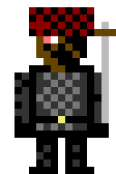
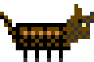

# TICKET-016: Gegner (Art-Style)

**Typ:** Design / Art Direction (Sub-Ticket)
**Epic:** Endzeit-Wirtschaftssimulator – Visuelle Identität
**Priorität:** Mittel
**Status:** Entwurf fertig, bereit für Review
**Abhängigkeiten:** TICKET-009 (Hauptticket), TICKET-010 (Generelle
Stilregeln), TICKET-005 (Konflikt/Randgruppen), TICKET-014
(Charaktersprite-Grundlagen)
**Geschwistertickets:** TICKET-012 bis TICKET-015, TICKET-017

> **Stilrevision (2026-09-20):** Verbindliche Stilreferenz ist ab sofort der
> C64-Look von *SKALD – Against the Black Priory*: 16-Farben-VIC-II-Palette,
> durchgängiges Bayer-Dithering, tiefschwarze Hintergründe. Die Struktur-,
> Raster- und Systemfestlegungen dieses Tickets gelten unverändert weiter;
> geändert haben sich Palette und Schattierungstechnik (Begründung und
> Regeln: TICKET-009, Abschnitt 20). Aktueller Asset-Satz:
> `design/assets/artstyle-c64/`, Generator: `tools/gen_assets_c64.py`.

## Ziel des Tickets

Visuelle Ausarbeitung der Gegnerfiguren, die außerhalb der drei
Hauptfraktionen (siehe TICKET-001) existieren: Banden/Räuber und wilde
Kreaturen, wie in TICKET-005 (Abschnitt 8) als "Randgruppen" beschrieben.
Diese Assets nutzen den in TICKET-014 definierten Grundaufbau, unterliegen
aber eigenen Silhouetten- und Farbregeln, um sie klar von den drei
spielbaren Fraktionen abzugrenzen.

## 0. Verhältnis zu TICKET-005 und TICKET-014

Dieses Ticket setzt zwei vorherige Festlegungen visuell um: die in
TICKET-005 (Abschnitt 8) beschriebene spielmechanische Rolle von
Randgruppen als neutrale, unberechenbare Drittpartei, sowie den in
TICKET-014 definierten technischen Sprite-Grundaufbau. Es führt keine
neuen Spielmechaniken ein, sondern übersetzt ausschließlich bestehende
Festlegungen in konkrete Pixel-Art-Regeln.

## 1. Referenzmockups: Räuber und Wildhund

Zwei Beispiel-Gegner wurden bereits erstellt
(`design/assets/artstyle/06a_gegner_raider.png`,
`06b_gegner_wildhund.png`): ein menschlicher Räuber im 16×24-Charakterraster
(siehe TICKET-010, Abschnitt 2) mit improvisierter Waffe und
Lumpenkopfbedeckung, sowie ein vierbeiniges Kreaturen-Sprite im breiteren
20×14-Format für einen verwilderten Wachhund/Wolfshybriden.

## 1.1 Warum nur zwei Referenzmockups genügen

Anders als bei den drei Fraktionen (TICKET-014), bei denen für jede
Fraktion mindestens ein Referenzsprite existiert, genügen für dieses
Ticket zwei Referenzbilder (ein menschlicher und ein tierischer Gegnertyp),
da alle weiteren, in diesem Ticket beschriebenen Varianten (Bedrohungsstufen
in Abschnitt 4, Sektenanhänger in Abschnitt 9, regionale Kreaturenvarianten
in Abschnitt 15) durch systematische Abwandlung dieser beiden Grundtypen
entstehen, statt jeweils komplett neue Silhouetten zu benötigen.

## 2. Menschliche Gegner: Banden und Räuber

Aufbauend auf TICKET-010 (Abschnitt 8.1) und TICKET-014 (Abschnitt 9.1)
nutzen menschliche Gegnersprites ausschließlich die Neutral- und
Erdgruppe (Grau-/Brauntöne) ohne feste Fraktionsakzentfarbe. Charakteristisch
sind improvisierte, asymmetrisch zusammengestellte Ausrüstung (siehe
Mockup: unterschiedlich lange Ärmel, notdürftig befestigte Waffe),
verhüllte Gesichter (Lumpen/Tuch statt erkennbarer Gesichtszüge, siehe
TICKET-013, Abschnitt 6: vereinfachte Porträts für Gegner) sowie ein
einzelner kleiner Warnrot-Akzent (z. B. ein rotes Stirnband), der Banden
optisch als "aggressiv/feindselig" markiert, ohne eine vollwertige
Fraktionsfarbe im Sinne von TICKET-010 (Abschnitt 1) zu etablieren.

## 3. Tierische/kreaturenhafte Gegner

Wie in TICKET-001 (Leitplanken: Realismus vor Sci-Fi/Magie) festgelegt,
sind auch tierische Gegner keine übernatürlichen Monster, sondern
verwilderte oder leicht mutierte reale Tierarten (verwilderte Hunde,
Wölfe, vereinzelt größere, aggressive Nagetiere aus kontaminierten Zonen).
Ihre Sprites (siehe Mockup Wildhund) nutzen ein breiteres, niedrigeres
Grundformat (ca. 20×14 statt 16×24 Pixel) mit vierbeiniger Silhouette,
gedecktem Braun-/Grauton und, bei kontaminationsnahen Varianten, einem
dezenten Toxic-Akzent (siehe TICKET-010, Abschnitt 16: Farbbeschränkung
für Kontamination) an Fell oder Augen, um eine Herkunft aus TICKET-002
(Abschnitt 2: Kontaminationszonen) anzudeuten, ohne die Kreatur dadurch
fantastisch wirken zu lassen.

## 3.1 Warum keine übernatürlichen Kreaturen

Konsistent mit der in TICKET-001 (Leitplanken) und TICKET-009 (Abschnitt
15) festgelegten Grundhaltung "geerdet statt spektakulär" werden bewusst
keine fantastischen Mutantenkreaturen (z. B. übergroße, mehrköpfige
Monster) eingeführt, auch wenn dies in vielen vergleichbaren
Endzeit-Settings üblich ist. Alle tierischen Gegner bleiben erkennbare,
wenn auch verwilderte oder leicht angepasste Varianten real existierender
Tierarten, um den in TICKET-001 etablierten Realismusanspruch auch bei den
Gegnerdesigns konsequent einzuhalten.

## 4. Abstufung nach Bedrohungsgrad

Gegner werden in drei grobe Bedrohungsstufen gegliedert, die sich in
Größe und Ausrüstungsdetail, nicht in grundlegend neuer Farbgebung
unterscheiden: **Einzelgänger** (kleinere Silhouette, minimale
Ausrüstung, z. B. ein einzelner Plünderer), **Bandenmitglied**
(Standardgröße wie im Mockup, mit improvisierter Waffe) und
**Bandenanführer** (leicht größere Silhouette, zusätzliches
Ausrüstungsdetail wie eine auffälligere, aber weiterhin improvisiert
wirkende Trophäe/Waffe). Diese Abstufung verzichtet bewusst auf
zusätzliche Farbcodierung, um Randgruppen nicht optisch mit den in
TICKET-010 (Abschnitt 1) definierten Fraktionsfarben zu verwechseln.

## 4.1 Numerische Balancing-Hinweise für die Bedrohungsstufen

Die drei Bedrohungsstufen aus Abschnitt 4 sollen nicht nur optisch, sondern
auch spielmechanisch gestaffelt auftreten: Einzelgänger treten häufig,
aber mit geringem wirtschaftlichem Schaden auf, Bandenmitgliedergruppen
seltener, aber mit spürbarem Schaden für Karawanen (siehe TICKET-004,
Abschnitt 7), Bandenanführer-Gruppen sehr selten, dafür mit erheblichem
Risiko für ganze Siedlungen (siehe TICKET-005, Abschnitt 3). Diese grobe
Häufigkeits-/Schadensstaffelung ist für die spätere Balancing-Iteration
(siehe TICKET-005, Offene Punkte) als Ausgangspunkt gedacht und nicht Teil
der eigentlichen visuellen Festlegung dieses Tickets.

## 5. Zusammenhang mit Konfliktsystem

Die in TICKET-005 (Abschnitt 3 und 8) beschriebenen Raid- und
Randkonflikt-Mechaniken werden visuell durch das plötzliche Erscheinen
dieser Gegnersprites auf der Hauptkarte (siehe TICKET-012, Abschnitt 7:
Bedrohungs-Overlay) unterstützt: Ein Bandenangriff auf eine Karawane wird
durch ein kurzes Erscheinen mehrerer Räuber-Sprites (Abschnitt 2) neben dem
Karawanen-Icon (siehe TICKET-012, Abschnitt 6) dargestellt, begleitet von
einem kurzen, hart geschnittenen Kampf-Frame (siehe TICKET-014, Abschnitt
6: Kampfanimation) statt einer ausführlichen Kampfszene.

## 5.1 Rückzug bei Verteidigungserfolg

Wehrt eine Siedlung oder Karawane einen Angriff erfolgreich ab (siehe
TICKET-005, Abschnitt 4: Verteidigungsmechanik), ziehen sich verbleibende
Gegner-Sprites über zwei bis drei Kartenschritte in Richtung des
nächstgelegenen Lagers (siehe Abschnitt 12) zurück, bevor sie vom
Bildschirm verschwinden, statt sofort spurlos zu verschwinden. Dieser
kurze, sichtbare Rückzug bestätigt dem Spieler visuell, dass die
Verteidigung tatsächlich Wirkung gezeigt hat, statt den Kampfausgang
ausschließlich über einen Textbericht im Benachrichtigungsprotokoll
(TICKET-008, Abschnitt 9) zu vermitteln, was der insgesamt stärker
visuell verankerten Spielerfahrung dieses Projekts gegenüber dem
Referenzspiel entspricht.

## 6. Herkunftsandeutung ohne feste Zuordnung

Da Randgruppen laut TICKET-005 (Abschnitt 8) keiner Hauptfraktion fest
zugeordnet sind, aber gelegentlich aus ehemaligen Mitgliedern einer
Fraktion bestehen können (siehe TICKET-007, Abschnitt 6: Migration/
Ausgrenzung), erhalten manche Räuber-Sprites optionale, stark abgenutzte
Restausrüstungsdetails in gedämpfter, "verblasster" Fraktionsfarbe (z. B.
ein stark verschmutztes, kaum noch erkennbares Bunker-Blau-Fragment am
Ärmel), die andeuten, dass diese Figur einst einer Fraktion angehörte, ohne
dadurch eine volle Fraktionszugehörigkeit im Sinne von TICKET-010
(Abschnitt 1) zu suggerieren.

## 6.1 Grenzen dieser Herkunftsandeutung

Die in Abschnitt 6 beschriebene verblasste Restausrüstung darf niemals so
deutlich gestaltet werden, dass ein Betrachter den Eindruck gewinnt, eine
Hauptfraktion (siehe TICKET-001) sei direkt für das Verhalten dieser
Randgruppe verantwortlich. Dies ist wichtig, um die in TICKET-005
(Abschnitt 8.1) beschriebene diplomatische Nutzbarkeit von Randkonflikten
(fälschliche Zuschreibung, gemeinsames Vorgehen gegen Banden) nicht durch
eine zu eindeutige visuelle Fraktionszuordnung zu untergraben.

## 7. Kreaturenvielfalt

Über den in Abschnitt 3 beschriebenen Wildhund hinaus werden für spätere
Erweiterung mindestens zwei weitere Kreaturentypen im selben
20×14-Grundformat vorgesehen: ein größerer, aggressiverer
Rudelanführer-Wolfshybrid sowie ein kleinerer, aber in Gruppen
gefährlicher Schwarm-Typ (z. B. verwilderte, vergrößerte Nagetiere), der
auf der Karte als Gruppen-Icon (siehe TICKET-014, Abschnitt 12) statt als
Einzelsprite dargestellt wird.

## 7.1 Gruppengröße und Kartendarstellung

Analog zu TICKET-014 (Abschnitt 12: Gruppendarstellung auf der
Hauptkarte) werden auch größere Banden oder Kreaturenrudel nicht als
viele Einzelsprites, sondern als ein kompaktes Gruppen-Icon dargestellt,
das aus zwei bis drei überlappenden Silhouetten besteht. Dies gilt
insbesondere für den in Abschnitt 7 beschriebenen Schwarm-Typ, bei dem eine
Einzeldarstellung ohnehin wenig sinnvoll wäre.

## 8. Zusammenspiel mit anderen Sub-Tickets

Gegnersprites folgen der in TICKET-014 definierten Grundlogik (Aufbau,
Animationssätze), grenzen sich aber durch die in TICKET-010 (Abschnitt
8.1) festgelegte Farblosigkeit klar von den drei spielbaren Fraktionen ab.
Ihre Ausrüstungsdetails (Abschnitt 2) nutzen dieselben Item-Icon-Prinzipien
wie TICKET-017.

## 9. Sektenanhänger als Sondervariante

Neben klassischen Banden erwähnt TICKET-001 (Abschnitt 2) auch
vereinzelte religiöse Sekten als Teil der kleineren Randgruppen der
Spielwelt. Für diese Sondervariante werden dieselben Grundregeln wie in
Abschnitt 2 angewendet (Neutral-/Erdgruppe, kein Fraktionsakzent), jedoch
mit einem charakteristischen, einheitlich getragenen Zusatzdetail (z. B.
eine schlichte, symbolhafte Anhänger-Silhouette in Off-White auf der
Brust), das Sektenanhänger als organisierter und einheitlicher wirkende
Gruppe von gewöhnlichen, chaotisch ausgerüsteten Banden unterscheidet,
ohne dass dafür eine neue Fraktionsfarbe eingeführt werden müsste.

## 10. Waffenvielfalt bei menschlichen Gegnern

Improvisierte Waffen (siehe Mockup: einfacher diagonaler Strich) werden in
drei Grundtypen variiert, die sich mit der in Abschnitt 4 beschriebenen
Bedrohungsstufe kombinieren lassen: Stich-/Schlagwaffen (kurzer, dicker
Strich in Mid-Grey), improvisierte Wurfwaffen (kleiner, heller Punkt neben
der Hand) und seltene, erbeutete Feuerwaffen (etwas länglicheres,
dunkleres Element mit hellem Mündungsakzent), wobei Feuerwaffen
ausschließlich bei Bandenanführern (Abschnitt 4) auftreten, um den in
TICKET-003 (Abschnitt 4) beschriebenen strukturellen Ausrüstungsvorteil
der Bunker-Fraktion nicht durch beliebig gut bewaffnete Randgruppen zu
untergraben.

## 11. Visuelle Vorwarnung vor Angriffen

Konsistent mit TICKET-005 (Abschnitt 4: Vorwarnsystem) erhalten
Gegnergruppen, bevor sie eine Karawane oder Siedlung tatsächlich angreifen,
eine kurze "lauernde" Idle-Pose (geduckte Haltung, siehe TICKET-014,
Abschnitt 6: Idle-Animation) am Kartenrand einer bedrohten Region, sichtbar
für Spieler mit ausreichender Aufklärung (siehe TICKET-006, Abschnitt 11:
Kundschafter, TICKET-014 Abschnitt 17: Rollenvariante Kundschafter). Diese
visuelle Vorwarnung ist die grafische Umsetzung der in TICKET-005
beschriebenen Vorwarnzeit und gibt dem Spieler eine faire Chance, auf einen
erkannten Bedrohungsherd zu reagieren, bevor der eigentliche Raid (siehe
TICKET-005, Abschnitt 3) beginnt.

## 12. Lager und Rückzugsorte von Randgruppen

Banden und Sektenanhänger (Abschnitt 9) benötigen, anders als die drei
Hauptfraktionen, keine vollständigen Siedlungsgebäude (siehe TICKET-015),
sondern werden mit einem einzelnen, einfachen Lager-Icon auf der Karte
verortet: eine kleine, unregelmäßige Ansammlung aus Zeltplanen und
Lagerfeuer-Andeutung (ein einzelner, in festen Intervallen zwischen zwei
Farbzuständen wechselnder Feuer-Pixel, passend zur limitierten
Animationsphilosophie aus TICKET-009, Abschnitt 5), bevorzugt im in
TICKET-002 (Abschnitt 10) beschriebenen Grauwald-Niemandsland platziert.

## 13. Vergleich zur Gegnerdarstellung im Referenzspiel

Burntime nutzte für Gegner oft ähnliche Grundsilhouetten wie für
spielbare Figuren, unterschied sie primär über Kontext und Textbeschreibung.
Für dieses Projekt wird bewusst eine stärkere visuelle Abgrenzung gewählt
(siehe Abschnitt 2: feste Farbbeschränkung auf Neutral-/Erdgruppe), da die
drei spielbaren Fraktionen (TICKET-001) hier eine deutlich zentralere
Rolle einnehmen als im Referenzspiel und daher klar von generischen
Gegnern unterscheidbar bleiben müssen, um Verwechslungen auf der
Hauptkarte (TICKET-012) zu vermeiden.

## 14. Produktionschecklist für neue Gegnertypen

Vor Abnahme eines neuen Gegner-Sprites wird geprüft: Verwendet es
ausschließlich Neutral-/Erdgruppenfarben ohne feste Fraktionsakzentfarbe
(Abschnitt 2)? Ist die Bedrohungsstufe (Abschnitt 4) über Größe und
Ausrüstungsdetail statt über neue Farbcodierung erkennbar? Bleibt bei
optionalen Restausrüstungsdetails (Abschnitt 6) die Farbe erkennbar
"verblasst" statt einer vollen Fraktionsfarbe zu entsprechen? Diese
Prüfung folgt derselben Grundlogik wie die in TICKET-014 (Abschnitt 5.1)
beschriebene Silhouettenprüfung.

## 15. Regionale Kreaturenvarianten

Aufbauend auf TICKET-002 (Abschnitt 2: Kontaminationsstufen) unterscheiden
sich Kreaturensprites (Abschnitt 3) leicht je nach Herkunftsregion:
Kreaturen aus sauberen oder gering belasteten Gebieten (Kornweiler,
Rothal-Randzone) erhalten keine zusätzlichen Farbdetails, während
Kreaturen aus mittel oder hoch belasteten Gebieten (Bittergraben,
Aschenfeld-Randzone) einen dezenten Toxic-Akzent (siehe Abschnitt 3)
erhalten. Diese regionale Variation ist rein optisch und signalisiert dem
Spieler zusätzlich zur Kartendarstellung (TICKET-012, Abschnitt 3), in
welcher Art von Gebiet er sich gerade befindet, selbst wenn das
Kontaminations-Overlay gerade ausgeblendet ist.

## 16. Skalierung der Bedrohung über die Spielzeit

Ähnlich der in TICKET-006 (Abschnitt 15) beschriebenen Forschungsgeschwindigkeit
sollen auch Gegnertypen im Lauf einer Spielsitzung sichtbar variieren: Zu
Beginn dominieren Einzelgänger und kleine Bandenmitgliedergruppen
(Abschnitt 4), im späteren Spielverlauf treten vermehrt Bandenanführer mit
Feuerwaffen (Abschnitt 10) sowie größere Kreaturenrudel (Abschnitt 7) auf.
Diese Eskalation wird nicht durch neue Farbcodierung, sondern
ausschließlich durch die bereits definierten Größen- und
Ausrüstungsabstufungen (Abschnitt 4) dargestellt, um das visuelle System
auch bei wachsender Bedrohung konsistent und lesbar zu halten.

## 17. Tod und Rückzugsdarstellung

Wird ein Gegner im Kampf besiegt (siehe TICKET-005, Abschnitt 3), wird dies
durch einen kurzen, liegenden Sprite-Frame (siehe TICKET-014, Abschnitt 6:
"Getroffen/Niedergehen") dargestellt, der nach wenigen Sekunden
verschwindet, ohne eine grafische Darstellung von Blut oder expliziter
Gewalt über die in TICKET-010 (Abschnitt 1) ohnehin nur sehr sparsam
vorhandene "Blood"-Akzentfarbe hinaus. Flüchtende, nicht besiegte Gegner
(z. B. bei erfolgreicher Verteidigung, siehe TICKET-005, Abschnitt 3)
werden durch eine beschleunigte Version der reguläre Gehanimation
(TICKET-014, Abschnitt 6) in Richtung Kartenrand dargestellt.

## 18. Zusammenfassung der Designabsicht

Gegner müssen im ansonsten auf drei klar profilierte Fraktionen
ausgerichteten visuellen System (TICKET-001, TICKET-010) sofort als
"außerhalb dieser Ordnung stehend" erkennbar sein, ohne dabei wie
beliebige, austauschbare Standard-Feinde zu wirken. Die in diesem Ticket
beschriebene Kombination aus fester Farbbeschränkung (Abschnitt 2),
abgestufter Bedrohungsdarstellung (Abschnitt 4) und gelegentlichen,
erzählerisch aufgeladenen Details (Abschnitt 6: verblasste
Restausrüstung) soll genau dieses Gleichgewicht zwischen klarer
Systemzugehörigkeit und individueller Wiedererkennbarkeit herstellen.

## Offene Punkte für Folgetickets

- Vollständiges Animationsset für Kreaturen (Vierbeiner-Gehzyklus).
- Zusätzliche Bandenanführer-Varianten mit individuellen Details.
- Balancing der Bedrohungsstufen (Abschnitt 4) in Verbindung mit TICKET-005.

## 19. Ausblick auf zukünftige Randgruppen

Sollten im Zuge späterer Erweiterungen (siehe TICKET-002, Abschnitt 13:
Nachbarregionen) neue Arten von Randgruppen eingeführt werden, gelten die
in diesem Ticket festgelegten Grundregeln unverändert weiter: feste
Beschränkung auf Neutral-/Erdgruppenfarben (Abschnitt 2), Abstufung über
Größe und Ausrüstung statt neue Farbcodierung (Abschnitt 4) sowie die in
Abschnitt 15 beschriebene regionale Variation über Kontaminationsbezug
statt über fraktionsähnliche Akzentfarben.

## Akzeptanzkriterien

- [x] Menschliche und tierische Gegnertypen mit eigener Farblogik
      abgegrenzt.
- [x] Bedrohungsstufen definiert.
- [x] Zusammenhang mit Raid-/Konfliktdarstellung auf der Karte beschrieben.
- [x] Herkunftsandeutung ohne feste Fraktionszuordnung ausgearbeitet.
- [x] Umfang mindestens 2000 Wörter.

## Beispielgrafiken (C64-Stilrevision)

Vorschau (hochskaliert); native Pixeldateien liegen unter
`design/assets/artstyle-c64/native/`.

