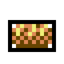

# TICKET-017: Items / Waren (Art-Style)

**Typ:** Design / Art Direction (Sub-Ticket)
**Epic:** Endzeit-Wirtschaftssimulator – Visuelle Identität
**Priorität:** Mittel-Hoch
**Status:** Entwurf fertig, bereit für Review
**Abhängigkeiten:** TICKET-009 (Hauptticket), TICKET-010 (Generelle
Stilregeln), TICKET-003 (Ressourcen/Produktionsketten), TICKET-004
(Handelsgüter)
**Geschwistertickets:** TICKET-011 bis TICKET-016

> **Stilrevision (2026-09-20):** Verbindliche Stilreferenz ist ab sofort der
> C64-Look von *SKALD – Against the Black Priory*: 16-Farben-VIC-II-Palette,
> durchgängiges Bayer-Dithering, tiefschwarze Hintergründe. Die Struktur-,
> Raster- und Systemfestlegungen dieses Tickets gelten unverändert weiter;
> geändert haben sich Palette und Schattierungstechnik (Begründung und
> Regeln: TICKET-009, Abschnitt 20). Aktueller Asset-Satz:
> `design/assets/artstyle-c64/`, Generator: `tools/gen_assets_c64.py`.

## Ziel des Tickets

Visuelle Ausarbeitung der Item- und Waren-Icons im 16×16-Grundraster
(siehe TICKET-010, Abschnitt 2): Ressourcen, Werkzeuge, Waffen, Medizin und
Handelsgüter, wie sie in TICKET-003 (Ressourcenkategorien) und TICKET-004
(Handelsgüterprofile) beschrieben sind. Diese Icons erscheinen sowohl im
Inventar-/Handelsfenster (TICKET-011, Abschnitt 6) als auch als
Statusindikatoren an Gebäuden (TICKET-015, Abschnitt 4).

## 0. Verhältnis zu TICKET-003 und TICKET-004

Dieses Ticket setzt zwei inhaltliche Systeme visuell um: die sechs
Ressourcenkategorien und Produktionsketten aus TICKET-003 sowie die
Handelsgüterprofile und Währungssysteme aus TICKET-004. Es führt keine
neuen Ressourcentypen oder Wirtschaftsmechaniken ein, sondern übersetzt
ausschließlich bestehende Festlegungen in ein konsistentes, 16×16-Pixel
großes Icon-System.

## 1. Referenzmockups: Sechs Item-Icons

Sechs Beispiel-Icons wurden bereits erstellt
(`design/assets/artstyle/07a_item_werkzeug.png` bis `07f_item_talon.png`):
Werkzeug (diagonales Werkzeug-Symbol), Waffe (spitz zulaufende Klinge),
Medizin (Flakon mit Flüssigkeitsfüllstand), Nahrung (Brotlaib-Andeutung),
Erz (facettierter Steinblock) sowie der Aarbrücker Talon (rundes
Münz-Icon). Diese sechs Icons decken exemplarisch die sechs
Ressourcenkategorien aus TICKET-003 (Abschnitt 2) ab.

## 1.1 Warum sechs statt weniger Referenzbeispiele

Anders als bei Gebäuden (TICKET-015: vier Referenzbeispiele) oder Sprites
(TICKET-014: drei Referenzbeispiele) wurden hier bewusst sechs
Referenz-Icons erstellt, da Item-Icons erstens die zahlenmäßig größte
Assetklasse des gesamten Projekts darstellen (jede einzelne in TICKET-003
benannte Ressource benötigt letztlich ein eigenes Icon) und zweitens die
in Abschnitt 3 beschriebene Farbkodierung nur dann überprüfbar ist, wenn
mindestens ein Beispiel pro Ressourcenkategorie tatsächlich existiert.

## 2. Grundprinzip: Ein Symbol pro Icon

Jedes Item-Icon reduziert seinen Gegenstand auf ein einziges, sofort
erkennbares Symbol statt einer realistischen Miniaturabbildung – ein
Werkzeug wird durch seine charakteristische Diagonale plus Griffteil
repräsentiert, nicht durch ein detailliertes Abbild eines bestimmten
Werkzeugtyps. Dieses Prinzip folgt direkt aus TICKET-009 (Abschnitt 4:
Silhouette statt Detailtreue) und ist bei der kleinen Icon-Größe von
16×16 Pixeln (TICKET-010, Abschnitt 2) ohnehin die einzige praktikable
Lösung.

## 2.1 Grenzen der Symbolabstraktion

Die in Abschnitt 2 beschriebene Abstraktion auf ein einziges Symbol
funktioniert nur, solange verschiedene Items innerhalb derselben Kategorie
(siehe TICKET-003, Abschnitt 3: z. B. mehrere Werkzeugtypen) sich durch die
in Abschnitt 5 und 16 beschriebenen Zusatzdetails (Technologiestufe,
fraktionstypischer Griff) ausreichend voneinander abheben. Sollte sich in
der späteren Produktion zeigen, dass zwei Items trotz dieser Zusatzdetails
verwechselbar bleiben, hat eine Anpassung der Grundsilhouette (nicht nur
der Zusatzdetails) Vorrang vor einer weiteren Häufung kleiner
Unterscheidungsmerkmale.

## 3. Farbkodierung nach Ressourcenkategorie

Aufbauend auf TICKET-003 (Abschnitt 2) und TICKET-010 (Abschnitt 1)
erhält jede der sechs Ressourcenkategorien eine dominante Icon-Farbe:
Nahrung (Brown-Light/Warn-Yellow, siehe Mockup Brotlaib), Rohstoffe
(Mid-Grey/Light-Grey, siehe Mockup Erz), Chemikalien & Spezialstoffe
(Toxic-Mid), Medizin & Heilpflanzen (Off-White mit Toxic-Light-Füllung,
siehe Mockup Medizinflakon), Werkzeuge/Waffen/Ausrüstung (Mid-Grey/
Brown-Dark, siehe Mockup Werkzeug und Waffe) sowie Energie & Treibstoff
(Warn-Yellow/Brown-Dark). Diese feste Farbkodierung ermöglicht es
Spielern, Ressourcenkategorien auch ohne Text auf einen Blick zu
unterscheiden, etwa im Inventarraster (TICKET-011, Abschnitt 6).

## 3.1 Konsistenz mit Gebäude- und Sprite-Farblogik

Die in Abschnitt 3 festgelegte Kategorie-Farbkodierung ist unabhängig von,
aber konsistent mit der in TICKET-010 (Abschnitt 1) beschriebenen
Fraktionsfarblogik: Ein Bunker-Werkzeug-Icon nutzt weiterhin die
Werkzeug-Kategorie-Farbe (Mid-Grey/Brown-Dark) und nicht etwa Bunker-Blau,
da die Kategorie-Zugehörigkeit eines Items unabhängig davon ist, welche
Fraktion es besitzt. Fraktionszugehörigkeit wird bei Items ausschließlich
über die in Abschnitt 16 beschriebenen kleinen Zusatzdetails vermittelt,
niemals über eine Änderung der Grundfarbe.

## 4. Mengenanzeige und Stapelung

Da Items in der Wirtschaftssimulation (siehe TICKET-003) meist in größeren
Mengen vorkommen, wird jedes Icon im Inventar-/Handelsfenster (TICKET-011,
Abschnitt 6) mit einer kleinen, im Bitmap-Font (TICKET-010, Abschnitt 6)
gehaltenen Mengenzahl in der unteren rechten Ecke kombiniert, ähnlich
klassischen Rollenspiel-Inventaren dieser Ära. Auf eine grafische
"Stapel-Andeutung" (z. B. mehrere übereinandergelegte Icons) wird
verzichtet, um die Icon-Fläche nicht unnötig zu überladen.

## 4.1 Rundungsregel bei sehr großen Mengen

Übersteigt eine Ressourcenmenge einen dreistelligen Wert, wird die
Mengenanzeige aus Abschnitt 4 gerundet und mit einem kleinen Suffix
dargestellt (z. B. "1.2k" statt "1234"), um die begrenzte Fläche des
16×16-Icons (Abschnitt 4) nicht durch überlange Zahlen zu sprengen. Diese
Rundungsregel gilt einheitlich für alle Ressourcenkategorien und
Fraktionen.

## 5. Qualitäts-/Zustandsvarianten

Werkzeuge und Waffen (siehe TICKET-006, Abschnitt 3-5: Technologiestufen)
erhalten, analog zu TICKET-014 (Abschnitt 8.1) und TICKET-015 (Abschnitt
5), nur an den Übergängen zwischen Technologiestufen ein sichtbar
verändertes Icon-Detail (z. B. ein zusätzlicher heller Kantenpixel bei
Tier-2-Werkzeugen, ein zusätzliches kleines Symbol bei Tier-3-Werkzeugen),
statt für jede Qualitätsstufe ein komplett neues Icon zu benötigen.
Verschlissene, kurz vor dem Ausfall stehende Werkzeuge (siehe TICKET-003,
Abschnitt 6: Verschleiß) erhalten stattdessen ein leicht "angeschlagenes"
Icon (ein bis zwei fehlende Randpixel), um Abnutzung visuell erkennbar zu
machen.

## 6. Handelswaren und Karawanendarstellung

Auf der Hauptkarte (siehe TICKET-012, Abschnitt 6) werden transportierte
Handelsgüter nicht einzeln dargestellt, sondern durch ein einzelnes,
representatives Icon über dem Karawanen-Sprite angezeigt (z. B. das
Nahrungsmittel-Icon, wenn die Karawane primär Getreide transportiert),
passend zur in TICKET-004 (Abschnitt 8) beschriebenen
Handelsgüterprofil-Logik je Fraktion. Bei gemischten Ladungen wird das
Icon der laut TICKET-004 (Abschnitt 2: Preisbildung) wertvollsten
transportierten Ware angezeigt.

## 6.1 Unterschiedliche Ladungsdarstellung nach Fraktion

Da die drei Fraktionen laut TICKET-004 (Abschnitt 8) unterschiedliche
Haupthandelsgüter besitzen, unterscheidet sich das auf der Karte
angezeigte Ladungssymbol (Abschnitt 6) auch systematisch nach
Herkunftsfraktion der Karawane: Bunker-Karawanen zeigen meist
Werkzeug-/Waffen-Icons, Mutierten-Karawanen meist Medizin-/
Chemikalien-Icons, Wastelander-Karawanen meist Nahrungsmittel-Icons. Diese
Tendenz ist keine feste Regel, sondern ergibt sich automatisch aus den in
TICKET-004 hinterlegten typischen Handelsgüterprofilen und muss nicht
gesondert kodiert werden.

## 7. Währungssymbole

Über den in Abschnitt 1 bereits erstellten Aarbrücker Talon hinaus
(rundes Münz-Icon, siehe TICKET-003, Abschnitt 5) werden die übrigen in
TICKET-003 beschriebenen Währungsformen als eigene, kleine Symbole
dargestellt: Bunker-Scrip als rechteckiger, gestempelter Papierschein
(Off-White mit einem kleinen Bunker-Blau-Stempelakzent), Sippen-Tauschehre
nicht als physisches Icon, sondern als abstraktes, im Handelsfenster
(TICKET-011, Abschnitt 6) dargestelltes Verpflichtungssymbol (zwei
ineinander verschlungene Linien in Mutant-Green), Warengeld der
Wastelander direkt über die entsprechenden physischen Item-Icons (Salz,
Munition, Konserven) statt über ein separates Symbol.

## 7.1 Visuelle Abgrenzung der Währungssymbole von Item-Icons

Damit Spieler Währungen (Abschnitt 7) nicht mit gewöhnlichen Handelsgütern
(Abschnitt 3) verwechseln, erhalten alle Währungssymbole unabhängig von
ihrer sonstigen Form einen einheitlichen, schmalen Pergamentfarbenen
Punktrahmen, der bei keinem regulären Ressourcen-Icon verwendet wird. Diese
konsistente Rahmenkonvention ist besonders im Handelsfenster (TICKET-011,
Abschnitt 6) wichtig, wo Waren und Zahlungsmittel oft nebeneinander
dargestellt werden.

## 8. Zusammenspiel mit anderen Sub-Tickets

Item-Icons werden in praktisch jedem anderen Sub-Ticket referenziert: im
Inventar-/Handelsfenster (TICKET-011), als Statusindikator an Gebäuden
(TICKET-015), als Ausrüstungsdetail an Charakteren (TICKET-014) und als
Ladungssymbol auf der Hauptkarte (TICKET-012). Diese zentrale Rolle macht
Konsistenz mit TICKET-010 (Abschnitt 1: Basispalette) hier besonders
wichtig.

## 9. Verderb und Lagerzustand visuell darstellen

Aufbauend auf TICKET-003 (Abschnitt 6: Lagerung, Verderb und Logistik)
erhalten verderbliche Ressourcen (Nahrung, Medizin) eine zusätzliche,
optionale "Verderbsstufe"-Darstellung: ein frisches Nahrungsmittel-Icon
(siehe Mockup) zeigt volle Farbsättigung, ein zunehmend verderbendes Icon
wechselt schrittweise zu einer entsättigten, bräunlich-grauen
Farbvariante (unter Verwendung derselben Palette, siehe TICKET-010,
Abschnitt 1, keine neuen Farben), bis es bei vollständigem Verderb durch
ein eigenes "unbrauchbar"-Icon (dunkelgraue, unregelmäßige Fläche mit
kleinem Schimmel-Andeutungspixel in Toxic-Dark) ersetzt wird. Diese drei
Zustände (frisch, verderbend, unbrauchbar) genügen, um die in TICKET-003
beschriebene Verderbsmechanik sichtbar zu machen, ohne eine unübersichtliche
Zahl feiner Zwischenstufen abbilden zu müssen.

## 10. Seltenheit und besondere Handelsgüter

Für die in TICKET-004 (Abschnitt 12) erwähnten selten verfügbaren
Fernhandelsgüter (z. B. exotische Waren von Fernhändlern aus den
Ostebenen, siehe TICKET-002, Abschnitt 13) wird eine dezente
Hervorhebung vorgesehen: ein einzelner, schmaler Pergamentfarbener
Rahmen um das Standard-Icon (im selben Stil wie die UI-Rahmenkacheln aus
TICKET-011, Abschnitt 2), der ein Item optisch als "besonders" markiert,
ohne dafür ein komplett neues Icon-Design zu benötigen. Diese Markierung
folgt bewusst dem gleichen sparsamen Prinzip wie die
Technologiestufen-Kennzeichnung in Abschnitt 5.

## 11. Item-Icons im Verhandlungskontext

Im Dialogsystem (siehe TICKET-011, Abschnitt 1 und TICKET-013) werden
Handelsangebote nicht nur textuell beschrieben, sondern zusätzlich durch
kleine, nebeneinander angeordnete Item-Icons visualisiert (z. B. ein
Werkzeug-Icon neben einem Medizin-Icon mit jeweiliger Mengenzahl, siehe
Abschnitt 4, bei der in TICKET-004, Abschnitt 11 beschriebenen
Beispielverhandlung Werkzeuge gegen Medizin). Diese Kombination aus Text
und Icon erleichtert es Spielern, Verhandlungsangebote auf einen Blick zu
erfassen, ohne den vollständigen Verhandlungstext lesen zu müssen.

## 12. Vergleich zur Inventardarstellung im Referenzspiel

Burntime nutzte für sein Inventarsystem einfache, aber klar lesbare
Icon-Listen ohne aufwändige Rahmeneffekte. Für dieses Projekt wird dieses
Grundprinzip übernommen (siehe Abschnitt 2: ein Symbol pro Icon), jedoch um
die in Abschnitt 4-5 beschriebenen zusätzlichen Statusebenen (Menge,
Qualität, Verderb) erweitert, da die deutlich detailliertere
Wirtschaftssimulation dieses Projekts (siehe TICKET-003) mehr
Informationsdichte pro Icon erfordert, als es im eher explorativ
ausgerichteten Referenzspiel notwendig war.

## 13. Icon-Raster im Inventarfenster

Das in TICKET-011 (Abschnitt 6) beschriebene Inventar-/Handelsfenster
ordnet Item-Icons in einem festen Raster mit 4-6 Icons pro Reihe an,
gruppiert nach Ressourcenkategorie (Abschnitt 3): Nahrung und Rohstoffe
zuerst, gefolgt von Chemikalien/Medizin, dann Werkzeuge/Waffen, zuletzt
Energie/Treibstoff. Diese feste Reihenfolge, kombiniert mit der in
Abschnitt 3 beschriebenen Farbkodierung, ermöglicht es erfahrenen Spielern,
ein bestimmtes Item auch ohne Beschriftung anhand seiner Position und
Farbe schnell wiederzufinden.

## 14. Produktionschecklist für neue Item-Icons

Vor Abnahme eines neuen Item-Icons wird geprüft: Ist das Symbol auch bei
16×16 Pixeln eindeutig einer der sechs Ressourcenkategorien (Abschnitt 3)
zuordenbar? Wird die dafür vorgesehene Kategorie-Farbe korrekt verwendet?
Ist bei Werkzeugen/Waffen die in Abschnitt 5 beschriebene
Technologiestufen-Kennzeichnung konsistent mit vergleichbaren, bereits
existierenden Icons? Diese Prüfung folgt derselben Grundlogik wie die in
TICKET-015 (Abschnitt 15) beschriebene Gebäude-Checkliste.

## 15. Kritische Knappheit visuell hervorheben

Sinkt der Bestand eines Items unter eine kritische Schwelle (siehe
TICKET-007, Abschnitt 10: Bedürfnisschwellen, sowie TICKET-004, Abschnitt
3: Knappheitsereignisse), wird das entsprechende Icon im Inventarfenster
(TICKET-011, Abschnitt 6) mit einem kleinen, in festen Intervallen
blinkenden Warnrot-Rahmen versehen, identisch zu dem in TICKET-011
(Abschnitt 6) beschriebenen Warnsymbol für blockierte Produktionsketten.
Diese Kopplung stellt sicher, dass Spieler kritische Engpässe sowohl auf
Gebäude- als auch auf reiner Bestandsebene über dasselbe visuelle
Warnvokabular erkennen, statt für unterschiedliche Knappheitsarten
unterschiedliche Warnsymbole lernen zu müssen.

## 16. Fraktionsspezifische Warenästhetik

Obwohl Item-Icons projektweit dieselbe Grundform und Farbkodierung
(Abschnitt 2-3) nutzen, erhalten einzelne, fraktionstypische Güter ein
kleines, kulturell passendes Zusatzdetail: Bunker-Werkzeuge zeigen einen
schlichten, geraden Griff (siehe Mockup), Mutierten-Werkzeuge (z. B.
Dritte-Hand-Feinwerkzeuge, siehe TICKET-006, Abschnitt 10) einen leicht
organisch gebogenen Griff, Wastelander-Werkzeuge einen sichtbar
notdürftig umwickelten Griff (zusätzlicher dunkler Wickel-Pixelstreifen).
Diese Details sind bewusst klein gehalten, um die in Abschnitt 3
festgelegte Kategorie-Farbkodierung nicht zu überlagern, tragen aber zur
in TICKET-001 beschriebenen kulturellen Differenzierung der Fraktionen
bei.

## 17. Icon-Verwendung außerhalb des Inventars

Über das Inventar-/Handelsfenster (TICKET-011, Abschnitt 6) hinaus werden
Item-Icons auch im Forschungsbildschirm (siehe TICKET-011, Abschnitt 15)
verwendet, um die Ressourcenkosten einer Technologie (siehe TICKET-006,
Abschnitt 7) direkt neben dem jeweiligen Technologie-Symbol darzustellen,
sowie im Ereignis- und Benachrichtigungssystem (TICKET-011, Abschnitt 9),
um etwa eine Lieferung oder einen Diebstahl textuell und gleichzeitig
über ein kleines begleitendes Icon zu kommunizieren. Diese durchgängige
Wiederverwendung derselben Icon-Bibliothek über mehrere Bildschirme hinweg
ist ein zentrales Mittel, um die in TICKET-009 (Abschnitt 9) geforderte
projektweite visuelle Konsistenz auch auf Ebene einzelner Icons zu
gewährleisten.

## 18. Zusammenfassung der Designabsicht

Item- und Waren-Icons sind die kleinteiligsten, aber am häufigsten
wiederkehrenden Grafikelemente des gesamten Spiels und müssen daher
besonders konsequent nach den in TICKET-009 und TICKET-010 festgelegten
Prinzipien gestaltet sein: ein einziges, eindeutiges Symbol pro Item,
feste Farbkodierung nach Ressourcenkategorie, und sparsame, aber
konsistente Zusatzmarkierungen für Qualität, Verderb und Knappheit. Jede
in diesem Ticket getroffene Entscheidung zielt darauf ab, dass Spieler
den Zustand ihrer Ressourcenwirtschaft (siehe TICKET-003) allein durch
einen Blick auf das Inventarraster erfassen können, ohne einzelne Werte
nachschlagen zu müssen.

## Offene Punkte für Folgetickets

- Vollständige Icon-Liste für alle in TICKET-003 benannten
  Einzelressourcen (Produktionsdetail).
- Konkrete Qualitätsstufen-Icons je Werkzeug-/Waffentyp.
- Technische Spezifikation für das Icon-Sprite-Sheet-Format.

## 19. Ausblick auf zukünftige Ressourcenkategorien

Sollten künftige Erweiterungen (siehe TICKET-002, Abschnitt 13;
TICKET-006, Abschnitt 17) neue Ressourcentypen einführen, die keiner der
sechs bestehenden Kategorien (Abschnitt 3) eindeutig zuzuordnen sind, ist
zunächst zu prüfen, ob eine bestehende Kategorie sinnvoll erweitert werden
kann, bevor eine siebte Kategorie mit eigener Farbkodierung eingeführt
wird. Dieses Vorgehen folgt der in TICKET-009 (Abschnitt 14) beschriebenen
Governance-Regel, wonach Änderungen an der projektweiten Basispalette nur
über das Hauptticket erfolgen sollen.

## Akzeptanzkriterien

- [x] Sechs Referenz-Icons für alle Ressourcenkategorien erstellt.
- [x] Farbkodierung je Ressourcenkategorie festgelegt.
- [x] Mengenanzeige- und Qualitätsvariantenlogik definiert.
- [x] Währungssymbole für alle vier Systeme aus TICKET-003 beschrieben.
- [x] Umfang mindestens 2000 Wörter.

## Beispielgrafiken (C64-Stilrevision)

Vorschau (hochskaliert); native Pixeldateien liegen unter
`design/assets/artstyle-c64/native/`.

